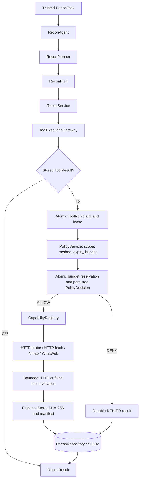

# Recon Day 1/2 architecture — frozen v1

Runtime: **Python 3.11**, consistent with CI and Docker. Recon uses deterministic plans and parsers. The existing FastAPI/LangGraph starter is separate from the implemented Recon engine.

## Execution boundary

Policy runs **inside the Gateway after the atomic claim**, and its final decision is committed before any adapter executes. Agents propose typed `CapabilityRequest` objects. Parsers have no network access. There is no arbitrary shell command, HTTP header, Host override, write method or redirect-following field.

`HTTP_PROBE` and `HTTP_FETCH` are available in the standard Python runner. Nmap and WhatWeb are registered only when `shutil.which` finds their binaries. `CapabilityRegistry.available_capabilities()` exposes the usable registry; an unavailable capability is denied before dispatch.

## Route, observation, baseline

| Record | Identity and responsibility |
|---|---|
| `WebEndpointEntry` | Task + method + canonical origin/path. Parameter schema and merged provenance. Query values never participate in the route ID. |
| `EndpointObservation` | Task + method + full canonical URL. Retains query order, repeated keys and values; discovered references can exist without fetching the endpoint. Holds its own request/response/evidence when fetched. |
| `BaselineRequest` | Route + request. Refers to the exact observation, concrete URL, complete 2xx response and evidence. |
| Shared `AttackSurfaceEntry` | Stable product handoff in `src/contracts/attack_surface.py`, with no import from Recon. Includes origin, parameters, observations, provenance, baseline/evidence refs and readiness. |

`/search?q=a` and `/search?q=b` produce one GET route and two observations. Different methods, origins, case or trailing slashes remain distinct. The first selected baseline remains linked to its concrete observation when later sources merge. Historical baselines remain stored if readiness is revoked.

`FUZZ_READY` requires current scope, a verified baseline, valid evidence, resolved required inputs and a testable endpoint. A parameterless `GET /profile` with a verified 2xx baseline qualifies. Downstream testing selects inputs/checkers. Forms, authenticated/manual operations, write methods and unresolved required inputs are never automatically submitted by Recon.

Before exporting, `build_inventory` verifies artifact hashes, response metadata, request/observation/baseline links, policy and scope. Each exported route has a trace through provenance → observation → source request → evidence. A candidate discovered in a document may have no request of its own; its provenance references the request that fetched that document. Unevidenced seeds stay internal. Invalid evidence revokes readiness at snapshot/export time.

## Durable execution and budgets

`ToolRun` states are `QUEUED`, `RUNNING`, `SUCCEEDED`, `FAILED`, `DENIED`, `TIMED_OUT`. The request ID is also the tool-run ID. The execution owner has a token, fingerprint, attempt number and 120-second lease. A completed request replays its stored result after restart. Reusing a known request ID with different content is rejected.

Active duplicate calls return an incomplete response without dispatch. Expired QUEUED/RUNNING requests become **durable FAILED** on recovery, Gateway entry or discovery resume. An expired lease cannot prove that the original worker never reached the network, so this version never reclaims or automatically retries the same request. Late owner results cannot overwrite the failure. Attempt remains 1. Recovery uses the original stored request; migrated orphan claims also terminate as FAILED. Call `recover_expired_runs(task_id)` when resuming a task; no background sweeper is installed.

The Gateway atomically reserves request/rate budgets with the final policy decision and transition to RUNNING. Limits belong to the stored task, not to caller-supplied counters. Reservations survive crashes/restarts and are never refunded. Direct Gateway calls receive the same checks as discovery plans:

- Total adapter attempts: default 128, hard maximum 1024.
- Sliding one-second rate: default 100, hard maximum 1000 requests.
- HTTP_FETCH attempts: also capped by `DiscoveryLimits.max_requests` (default 64).
- Capability timeout and HTTP body limits must fit `ExecutionBudget`; HTTP_FETCH also has fixed maxima of 10 seconds per network operation and 128 KiB retained body.

Denied calls consume no dispatch reservation. `PolicyDecision` exposes ALLOW/DENY/REQUIRE_APPROVAL, version, fingerprint, reason, risk and attempt; Recon produces only ALLOW/DENY. `budget_context` identifies the trusted task and cannot override its limits. Coverage exposes runtime attempts; durable decisions explain budget/rate denials.

## Persistence and evidence

`src/storage/migrations.py` is the single SQLite schema authority. Ordered migrations run under `BEGIN IMMEDIATE`, record versions in `schema_migrations`, and roll back on failure. Unknown future schemas are rejected.

Stop existing Recon workers before upgrading the database; running old and new worker versions against the same database during this schema transition is unsupported.

1. Adopt existing Day-1/Day-2 tables, including unversioned databases.
2. Split concrete observations from routes, merge old query variants, migrate baseline refs.
3. Add ToolRun, policy audit, durable budget reservations and evidence manifest fields.

Task, plan, source, result, policy and evidence history is preserved. Only derived Recon snapshots/coverage are invalidated during the route migration. Old readiness is reverified from original evidence on the next snapshot. Evidence bytes and their SHA-256 values are unchanged.

The shared `EvidenceManifest` records run/task/request/tool-run, kind, hash, byte size, content type, capture time, redaction status and metadata. `EvidenceArtifact` adds the local relative path. New captures are `UNREVIEWED`; this is a classification, not a claim that redaction was performed. HTTP evidence is an envelope with URL/method, response metadata and bounded body; both artifact and body digests are checked.

## Discovery, coverage and integration

HTML, robots, sitemap/index, OpenAPI/Swagger and simple JavaScript parsers feed deterministic discovery rounds through the same boundary. Coverage reports route, observation, source, verified baseline and FUZZ_READY counts separately, plus source statuses, rounds and runtime attempts. Convergence describes the supported discovery queue; it does not prove exhaustive application coverage.

Product API/Supervisor integration is a later step. Its input is a trusted stored `ReconTask`; execution is `ReconAgent.run(task_id)`; handoff is `ReconResult.attack_surface_inventory` serialized as shared **AttackSurfaceInventory v1.0**. Consumers import `src.contracts`, not Recon internals. [Contract and integration guide](docs/day2-endpoint-discovery.md) defines refs and versioning; [schema fixture](tests/fixtures/attack-surface-v1.schema.json) guards the freeze.

**Hostname/VHost integration gate:** the implemented lab uses literal IPs, including localhost E2E. `authority` and `resolved_ip` are separate output fields, but hostname dispatch is not implemented. Before a hostname-based staging lab, trusted target configuration must pin authority, resolved IP and port, and preserve Host/TLS SNI with certificate verification. Agents must never supply arbitrary Host values. This is a P1 follow-up for the current IP lab and a P0 integration blocker if the product lab requires domains.

Browser/CDP, CVE/RAG, fuzzing, validation, payload selection, findings, HITL UI and reports are outside this freeze. Future observation sources must retain the same Policy/Gateway boundary.

## Verification

Run `python -B -m ruff check --no-cache src tests` and `python -B -m pytest -p no:cacheprovider tests -q`. Tests include all Day-1 behaviors, a real localhost multi-source fixture, route/observation merge, evidence revocation, shared schema, legacy migration, restart/lease recovery, concurrent budget reservation and registry availability. GitHub Actions uses Python 3.11 on Ubuntu; remote CI status requires a pushed run.

Local freeze verification: **88 tests passed; Ruff passed**.
