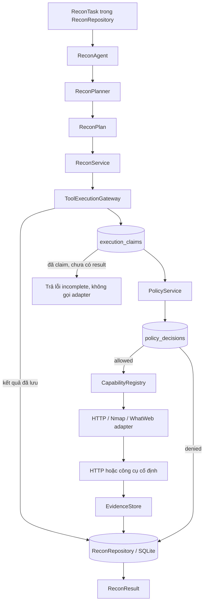
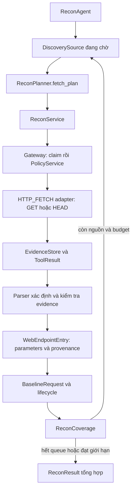

# Kiến trúc Recon Day 1/2

## Tổng quan

Recon Day 1 nhận một `ReconTask` đã được lưu với danh sách IP, cổng, capability và thời hạn. `ReconAgent` dùng `ReconPlanner` xác định để tạo `ReconPlan`, rồi `ReconService` đưa từng `CapabilityRequest` qua `ToolExecutionGateway`. Gateway claim request trước khi kiểm tra policy hoặc gọi adapter; policy decision, tool result và evidence được lưu để truy vết theo `request_id`.

Day 2 mở rộng task thành nhiều vòng plan, lưu inventory endpoint và baseline. FastAPI và LangGraph trong repo là starter riêng; Recon dùng planner và parser xác định.

## Luồng thực thi

Gateway gọi `PolicyService` sau khi claim thành công và lưu `PolicyDecision` **trước** khi dispatch adapter. Kết quả trùng `request_id` được đọc từ repository; nếu một request đã claim nhưng chưa có result, Gateway trả lỗi `request already claimed or incomplete` và không gọi tool thêm lần nữa.

## Thành phần Day 1

| Thành phần | Trách nhiệm |
|---|---|
| `ReconTask`, `ReconPlan`, `CapabilityRequest` | Hợp đồng Pydantic chặt chẽ cho scope, hành động và tham số có kiểu; không nhận lệnh shell thô. |
| `ReconAgent`, `ReconPlanner` | Tải task theo ID, tạo plan xác định từ IP, cổng và capability được phép. Mỗi IP có tối đa một Nmap action cho 32 cổng đầu; mỗi cổng có HTTP probe và WhatWeb nếu được cấp capability. |
| `ReconService` | Chạy các action qua Gateway, tổng hợp `ToolResult`, attack surface, technology và evidence thành `ReconResult`. |
| `PolicyService` | Từ chối mặc định task thiếu/hết hạn, IP, cổng hoặc capability ngoài scope. |
| `ToolExecutionGateway`, `CapabilityRegistry` | Claim request nguyên tử, lưu policy decision, chọn adapter đã đăng ký và ghi tool result. |
| HTTP, Nmap, WhatWeb adapters | Tạo thao tác cố định, bounded; HTTP dùng HEAD và không theo redirect. Nmap/WhatWeb dùng subprocess với timeout và giới hạn output. |
| Parsers | Trích xuất attack surface và technology từ output Nmap/WhatWeb theo quy tắc xác định. |
| `EvidenceStore`, `ReconRepository` | Lưu evidence tối đa 256 KiB với SHA-256, metadata và các bảng SQLite cho task, claim, decision, tool result, evidence, recon result. |

## Discovery Day 2

`ReconService` lưu từng plan và tổng hợp mọi tool result của task; `recon_results` là snapshot cập nhật, không chặn plan tiếp theo. Request trùng vẫn đi qua cơ chế claim/kết quả đã lưu của Day 1. Các bảng mới gồm `recon_plans`, `web_endpoints`, `discovery_sources`, `baseline_requests` và `recon_coverage`.

HTTP_FETCH cần path được cấp phép rõ ràng, chỉ GET/HEAD, không tự theo redirect, mặc định timeout 5 giây và body tối đa 128 KiB. Parser nhận dữ liệu từ evidence đã kiểm tra SHA-256 và không tự gọi mạng. Form, operation ghi dữ liệu và endpoint thiếu tham số bắt buộc chỉ được ghi vào inventory.

Lifecycle là `DISCOVERED → OBSERVED → BASELINED → FUZZ_READY`. Baseline cần response 2xx đầy đủ và evidence hợp lệ; FUZZ_READY còn cần query input cụ thể và không có yêu cầu nhập thủ công. Coverage phân biệt queue đã hội tụ với nguồn bị chặn, lỗi hoặc hết budget. Chi tiết quy tắc và ví dụ sử dụng nằm trong [tài liệu Day 2](docs/day2-endpoint-discovery.md).

## Ranh giới và kiểm chứng

Chỉ IP và cổng được ghi trong task mới được thực thi. Scheme Day 1 là HTTPS cho cổng 443, 8443, 9443 và HTTP cho các cổng còn lại. Nmap/WhatWeb không bắt buộc được cài để chạy unit test; test HTTP localhost dùng mạng thật, đi qua Agent → Gateway → Policy → adapter → Evidence → ReconResult.

Chạy `ruff check src/ tests/` và `pytest tests/ -v --tb=short`. Bộ test giữ các kiểm tra Day 1 và thêm HTTP E2E nhiều nguồn cho Day 2. CI dùng `ubuntu-latest` với giới hạn 10 phút; kết quả GitHub Actions cần được xác nhận sau khi push.
