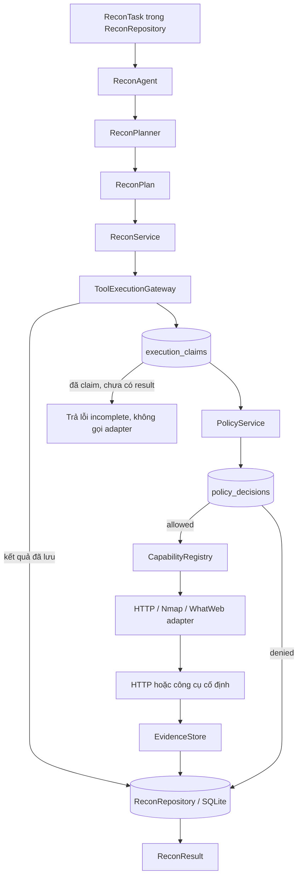

# Kiến trúc Recon Day 1

## Tổng quan

Recon Day 1 nhận một `ReconTask` đã được lưu với danh sách IP, cổng, capability và thời hạn. `ReconAgent` dùng `ReconPlanner` xác định để tạo `ReconPlan`, rồi `ReconService` đưa từng `CapabilityRequest` qua `ToolExecutionGateway`. Gateway claim request trước khi kiểm tra policy hoặc gọi adapter; policy decision, tool result và evidence được lưu để truy vết theo `request_id`.

Đây là luồng Recon hiện đã triển khai. FastAPI và LangGraph trong repo là starter riêng; Recon Day 1 không cần LLM hoặc LangGraph để lập plan.

## Luồng thực thi

Gateway gọi `PolicyService` sau khi claim thành công và lưu `PolicyDecision` **trước** khi dispatch adapter. Kết quả trùng `request_id` được đọc từ repository; nếu một request đã claim nhưng chưa có result, Gateway trả lỗi `request already claimed or incomplete` và không gọi tool thêm lần nữa.

## Thành phần Day 1

| Thành phần | Trách nhiệm |
|---|---|
| `ReconTask`, `ReconPlan`, `CapabilityRequest` | Hợp đồng Pydantic chặt chẽ cho scope, hành động và tham số có kiểu; không nhận lệnh shell thô. |
| `ReconAgent`, `ReconPlanner` | Tải task theo ID, tạo plan xác định từ IP, cổng và capability được phép. Mỗi IP có tối đa một Nmap action cho 32 cổng đầu; mỗi cổng có HTTP probe và WhatWeb nếu được cấp capability. |
| `ReconService` | Chạy các action qua Gateway, tổng hợp `ToolResult`, attack surface, technology và evidence thành `ReconResult`. |
| `PolicyService` | Từ chối mặc định task thiếu/hết hạn, IP, cổng hoặc capability ngoài scope. |
| `ToolExecutionGateway`, `CapabilityRegistry` | Claim request nguyên tử, lưu policy decision, chọn adapter đã đăng ký và ghi tool result. |
| HTTP, Nmap, WhatWeb adapters | Tạo thao tác cố định, bounded; HTTP dùng HEAD và không theo redirect. Nmap/WhatWeb dùng subprocess với timeout và giới hạn output. |
| Parsers | Trích xuất attack surface và technology từ output Nmap/WhatWeb theo quy tắc xác định. |
| `EvidenceStore`, `ReconRepository` | Lưu evidence tối đa 256 KiB với SHA-256, metadata và các bảng SQLite cho task, claim, decision, tool result, evidence, recon result. |

## Ranh giới và kiểm chứng

Chỉ IP và cổng được ghi trong task mới được thực thi. Scheme Day 1 là HTTPS cho cổng 443, 8443, 9443 và HTTP cho các cổng còn lại. Nmap/WhatWeb không bắt buộc được cài để chạy unit test; test HTTP localhost dùng mạng thật, đi qua Agent → Gateway → Policy → adapter → Evidence → ReconResult.

Chạy `ruff check src/ tests/` và `pytest tests/ -v --tb=short`. Lần kiểm tra cục bộ gần nhất: **25 test pass**, Ruff pass. CI dùng `ubuntu-latest` với giới hạn 10 phút; kết quả GitHub Actions cần được xác nhận sau khi push.
