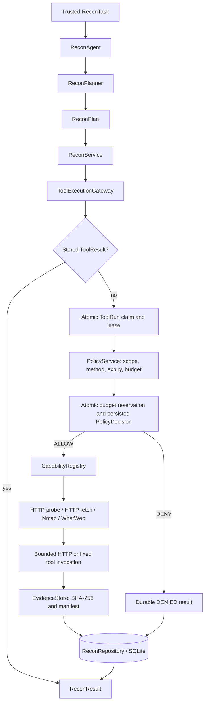

# Recon architecture — Day 03 Ver02

Runtime: **Python 3.11**, consistent with CI and Docker. Recon uses deterministic plans and parsers. The existing FastAPI/LangGraph starter is separate from the implemented Recon engine.

## Execution boundary

Policy runs **inside the Gateway after the atomic claim**, and its final decision is committed before any adapter executes. Agents propose typed `CapabilityRequest` objects. Parsers have no network access. There is no arbitrary shell command, HTTP header, Host override, write method or redirect-following field.

`HTTP_PROBE` and `HTTP_FETCH` are available in the standard Python runner. Nmap and WhatWeb are registered only when `shutil.which` finds their binaries. `BROWSER_EXPLORE` is registered only after a bounded subprocess successfully launches Chromium and checks WebSocket interception. Package installation alone is insufficient. Runtime loss after the probe produces a durable adapter error. CI installs Chromium/system dependencies, probes the runtime, and requires the real browser tests to run.

## Route, observation, baseline

| Record | Identity and responsibility |
|---|---|
| `WebEndpointEntry` | Task + method + canonical origin/path. Parameter schema and merged provenance. Query values never participate in the route ID. |
| `EndpointObservation` | Task + method + full canonical URL. Retains query order, repeated keys and values; discovered references can exist without fetching the endpoint. Holds its own request/response/evidence when fetched. |
| `BaselineRequest` | Route + request. Refers to the exact observation, concrete URL, complete 2xx response and evidence. |
| Shared `AttackSurfaceEntry` | Stable product handoff in `src/contracts/attack_surface.py`, with no import from Recon. Includes origin, parameters, observations, provenance, baseline/evidence refs and readiness. |

`/search?q=a` and `/search?q=b` produce one GET route and two observations. A unique OpenAPI template such as `/users/{id}` can also group concrete paths as observations. `route_template` is null for literal routes. Different methods, origins, case or trailing slashes remain distinct. The first selected baseline remains linked to its concrete observation when later sources merge. Historical baselines remain stored if readiness is revoked. See [ADR 0002](docs/adr/0002-day02-execution-and-route-contracts.md).

`FUZZ_READY` requires current scope, a verified baseline, valid evidence, resolved required inputs and a testable endpoint. A parameterless `GET /profile` with a verified 2xx baseline qualifies. Downstream testing selects inputs/checkers. Forms, authenticated/manual operations, write methods and unresolved required inputs are never automatically submitted by Recon.

Before exporting, `build_inventory` verifies artifact hashes, response metadata, request/observation/baseline links, policy and scope. Each exported route has a trace through provenance → observation → source request → evidence. A candidate discovered in a document may have no request of its own; its provenance references the request that fetched that document. Unevidenced seeds stay internal. Invalid evidence revokes readiness at snapshot/export time.

## Durable execution and budgets

`ToolRun` states are `QUEUED`, `RUNNING`, `SUCCEEDED`, `FAILED`, `DENIED`, `TIMED_OUT`, `CANCELLED`. The request ID is also the tool-run ID. The execution owner has a token, fingerprint, attempt number and 120-second lease. A completed request replays its stored result after restart. Reusing a known request ID with different content is rejected.

`action_fingerprint` is separate from request ID. It binds run, task, exact IP target, capability, typed parameters and trusted task/policy context. The Gateway binds legacy Recon callers to stored task metadata; supplied conflicting metadata is denied. `PolicyDecision` stores action/scope/policy fingerprints and typed `Risk` R0–R4. See [ADR 0002](docs/adr/0002-day02-execution-and-route-contracts.md).

Active duplicate calls return an incomplete response without dispatch. Expired QUEUED/RUNNING requests become **durable FAILED** on recovery, Gateway entry or discovery resume. An expired lease cannot prove that the original worker never reached the network, so this version never reclaims or automatically retries the same request. Late owner results cannot overwrite the failure. Attempt remains 1. Recovery uses the original stored request; migrated orphan claims also terminate as FAILED. Call `recover_expired_runs(task_id)` when resuming a task; no background sweeper is installed.

The Gateway atomically reserves request/rate budgets with the final policy decision and transition to RUNNING. Limits belong to the stored task, not to caller-supplied counters. Reservations survive crashes/restarts and are never refunded. Direct Gateway calls receive the same checks as discovery plans:

- Total adapter attempts: default 128, hard maximum 1024.
- Sliding one-second rate: default 100, hard maximum 1000 requests.
- HTTP_FETCH attempts: also capped by `DiscoveryLimits.max_requests` (default 64).
- Capability timeout and HTTP body limits must fit `ExecutionBudget`; HTTP_FETCH also has fixed maxima of 10 seconds per network operation and 128 KiB retained body.

Denied calls consume no dispatch reservation. `PolicyDecision` exposes ALLOW/DENY/REQUIRE_APPROVAL, version, fingerprint, reason, risk and attempt; Recon produces only ALLOW/DENY. `budget_context` identifies the trusted task and cannot override its limits. Coverage exposes runtime attempts; durable decisions explain budget/rate denials.

## Persistence and evidence

`src/storage/migrations.py` is the single SQLite schema authority. Ordered migrations run under `BEGIN IMMEDIATE`, record versions in `schema_migrations`, and roll back on failure. Unknown future schemas are rejected.

Stop existing Recon workers before upgrading the database; running old and new worker versions against the same database during this schema transition is unsupported.

1. Adopt existing Day-1/Day-2 tables, including unversioned databases.
2. Split concrete observations from routes, merge old query variants, migrate baseline refs.
3. Add ToolRun, policy audit, durable budget reservations and evidence manifest fields.
4. Bind historical ToolRun payloads for replay and normalize legacy risk without inventing historical approval fingerprints.
5. Mark declared path templates and discard historical placeholder observations that were never concrete requests.

Task, plan, source, result, policy and evidence history is preserved. Only derived Recon snapshots/coverage are invalidated during the route migration. Old readiness is reverified from original evidence on the next snapshot. Evidence bytes and their SHA-256 values are unchanged.

The shared `EvidenceManifest` records run/task/request/tool-run, kind, hash, byte size, content type, capture time, redaction status and metadata. `EvidenceArtifact` adds the local relative path. New captures are `UNREVIEWED`; this is a classification, not a claim that redaction was performed. HTTP evidence is an envelope with URL/method, response metadata and bounded body; both artifact and body digests are checked.

## Discovery, coverage and integration

HTML, robots, sitemap/index, OpenAPI/Swagger and simple JavaScript parsers feed deterministic discovery rounds through the same boundary. Coverage reports route, observation, source, verified baseline and FUZZ_READY counts separately, plus source statuses, rounds and runtime attempts. Convergence describes the supported discovery queue; it does not prove exhaustive application coverage.

Product API/Supervisor integration is a later step. Its input is a trusted stored `ReconTask`; execution is `ReconAgent.run(task_id)`; handoff is `ReconResult.attack_surface_inventory` serialized as shared **AttackSurfaceInventory v1.0**. Consumers import `src.contracts`, not Recon internals. [Contract and integration guide](docs/day2-endpoint-discovery.md) defines refs and versioning; [schema fixture](tests/fixtures/attack-surface-v1.schema.json) guards the freeze.

The passive Browser path implements [ADR 0003](docs/adr/0003-browser-execution-boundary.md): navigation and every child resource pass the Gateway/Policy boundary before network continuation. The Python 3.11 choice is recorded in [ADR 0001](docs/adr/0001-mvp-python-runtime.md).

**Hostname/VHost integration gate:** the implemented lab uses literal IPs, including localhost E2E. `authority` and `resolved_ip` are separate output fields, but hostname dispatch is not implemented. Before a hostname-based staging lab, trusted target configuration must pin authority, resolved IP and port, and preserve Host/TLS SNI with certificate verification. Agents must never supply arbitrary Host values. This is a P1 follow-up for the current IP lab and a P0 integration blocker if the product lab requires domains.

Browser-Use, CVE/RAG, fuzzing, validation, payload selection, findings, HITL UI and reports remain outside this implementation. Future observation sources must retain the same Policy/Gateway boundary.

## Verification

Run `python -B -m ruff check --no-cache src tests` and `python -B -m pytest -p no:cacheprovider tests -q`. Tests include all Day-1 behaviors, a real localhost multi-source fixture, route/observation merge, evidence revocation, shared schema, legacy migration, restart/lease recovery, concurrent budget reservation and registry availability. GitHub Actions uses Python 3.11 on Ubuntu; remote CI status requires a pushed run.

Day 03 verification includes parent/child authorization, one-use continuation permits, cancellation fencing, bounded BFS, template reconciliation, baseline preservation and restart. A real forbidden sink server first proves it is reachable, then must receive zero off-scope HTTP requests, including redirected traffic. Missing Chromium is a CI failure; local environments may skip browser tests unless `RECON_REQUIRE_CHROMIUM=1` is set.

## Day 03 Ver02 passive browser discovery

After the existing deterministic discovery phase, `ReconAgent` runs `BrowserDiscovery` only when the task allows `BROWSER_EXPLORE` and the registry has its adapter. The phase persists a deterministic plan covering sorted literal-IP origins. Its root is the first sorted in-scope discovery seed, falling back to allowed paths. Restart reuses the persisted plan and terminal ToolResults, including cancellations and expired-lease failures; it never replays an uncertain network dispatch.

`BROWSER_EXPLORE` is a bounded parent ToolRun. Its Playwright adapter creates a fresh non-persistent Chromium context with service workers blocked and downloads disabled. It installs HTTP, response and WebSocket interception before navigation. Sorted, normalized same-origin anchors feed a bounded BFS. Each page is closed before the next page begins. Forms are inventory only, including GET forms. Links marked `download`, popups, frames, unplanned navigations and requests without a guarded main frame are not followed. Fixed DOM code executes in an isolated world with a deadline; no Agent-provided expression, click or submission is accepted.

For each intercepted GET/HEAD URL, the adapter derives a deterministic child `BROWSER_REQUEST` ID from the parent ID, page sequence, method and canonical literal-IP URL. Page zero retains Ver1 identity/serialization for persisted fingerprint compatibility. Repeated URLs within a page deduplicate; the same resource on another page has a different request ID and action fingerprint. It calls `begin_external_dispatch()` to claim the child, persist policy and reserve budget, then consumes `authorize_external_continuation()` once before `route.continue_()`. `finish_external_dispatch()` stores evidence and the child ToolResult. There is no parallel `HTTP_FETCH`. The repository verifies parent origin, page/body/timeout bounds and the durable dispatch count.

Chromium can follow a redirect after `route.continue_()` without a second Playwright route callback. A CDP Fetch guard pauses every response before Chromium consumes it and rejects all 3xx responses. Requests still require the original Gateway permit before reaching the server. Missing or failed interception aborts the response.

Parent and child ToolRuns contain `parent_request_id`; evidence metadata additionally records resource type and page sequence. Child evidence is typed `http_exchange`. Fixed DOM link/form observations are included in the successful document's evidence envelope before finalization. Network and DOM provenance enter the existing `EndpointObservation`, template reconciliation and `AttackSurfaceInventory v1.0` path. Browser projection preserves prior verified HTTP observations/baselines and is repairable from persisted evidence after a crash. It does not create baselines or promote new routes to `FUZZ_READY`.

`cancel_tool_run()` atomically writes terminal `CANCELLED` results for a live parent and its children. Later callbacks receive the stored cancellation result; no late evidence can replace that result. The adapter checks parent state and runtime deadline before each dispatch and navigation.

`BrowserLimits` bounds pages, depth, requests, runtime, total admitted body bytes and each response's body bytes. The response guard requires identity encoding and an explicit valid `Content-Length` for body-bearing responses; unknown lengths, chunked/compressed bodies, attachments and oversized responses are rejected before being admitted to the renderer. HEAD and bodyless 204/205 responses charge zero bytes. These are admission bounds, not a transport firewall or exact wire-byte meter: headers and bytes already buffered by Chromium are outside the body budget.

HTTP evidence retains response metadata and an empty body, marked truncated for nonempty GET bodies; `transfer_complete` distinguishes interrupted transfers. DOM capture has a separate maximum of 64 KiB, further capped by `max_response_bytes`. Parent evidence records visited pages/depth, admitted bytes, dispatch count and stop reason. See [Day 03 configuration and limits](docs/day3-browser-discovery.md).
