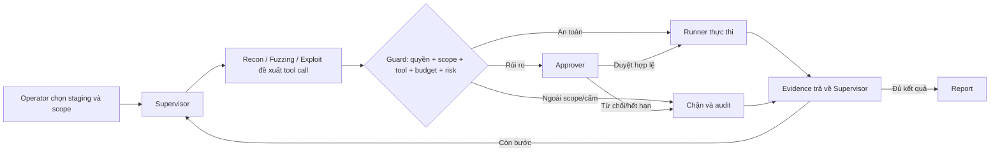

# PentestSyndicate

PentestSyndicate là đề tài VSOC-04 của nhóm P-077: một web app điều phối nhiều AI agent để hỗ trợ kiểm thử bảo mật trong môi trường staging hoặc lab đã được cấp phép. Operator tạo phiên kiểm tra; Supervisor điều phối Recon, Fuzzing và Exploit; Approver là con người quyết định trước hành động rủi ro; hệ thống tổng hợp bằng chứng và tạo báo cáo.

## Gate 1 — Chốt bài toán và thiết kế

Toàn bộ hồ sơ Gate 1 nằm tại:

**[Mở bộ hồ sơ Gate 1](docs/gate-1/README.md)**

| Deliverable | Link |
|---|---|
| One-page Brief | [docs/gate-1/01-one-page-brief.md](docs/gate-1/01-one-page-brief.md) |
| PRD | [docs/gate-1/02-prd.md](docs/gate-1/02-prd.md) |
| Wireframe & UI Flow | [docs/gate-1/03-wireframe-ui-flow.md](docs/gate-1/03-wireframe-ui-flow.md) |
| GitHub Repo & AI Log Setup | [docs/gate-1/04-github-ai-log-setup.md](docs/gate-1/04-github-ai-log-setup.md) |
| Checklist nộp Gate | [docs/gate-1/05-gate-submission-checklist.md](docs/gate-1/05-gate-submission-checklist.md) |

## Trạng thái hiện tại

Recon Day 1 đã có luồng thực thi từ task đến kết quả và bằng chứng; Day 2 bổ sung nền tảng discovery endpoint qua nhiều vòng xác định. FastAPI/LangGraph starter vẫn nằm trong repo; workflow nhiều agent, frontend, phân quyền, HITL và report thuộc thiết kế mục tiêu.

**Recon Day-1 backbone đã triển khai:**

- Hợp đồng dữ liệu có kiểu cho `ReconTask`, `ReconPlan` và `CapabilityRequest`.
- `PolicyService` từ chối mặc định các IP, cổng và capability ngoài scope.
- `ToolExecutionGateway` là điểm điều phối thực thi; `request_id` được claim nguyên tử trước policy và adapter để tránh chạy tool hai lần.
- Adapter HTTP probe, Nmap và WhatWeb với tham số cố định, giới hạn thực thi; parser Nmap/WhatWeb xác định.
- SQLite lưu task, execution claim, policy decision, tool result, metadata evidence và Recon result.
- `EvidenceStore` giới hạn kích thước và kiểm tra toàn vẹn SHA-256 khi đọc.
- `ReconPlanner` tạo plan xác định từ scope; `ReconAgent` chạy trực tiếp từ `task_id`.
- Test đầu cuối HTTP trên `127.0.0.1` đi qua Agent, Policy, Gateway, adapter, Evidence và Repository.

**Recon Day 2 đã triển khai:**

- Nhiều `ReconPlan` trong cùng task, giữ claim và idempotency theo từng request.
- `HTTP_FETCH` chỉ GET/HEAD, kiểm tra path/method scope, không theo redirect, có timeout và giới hạn body.
- Parser HTML, robots, sitemap/index, OpenAPI 3/Swagger 2 và JavaScript đơn giản; gộp endpoint và provenance theo quy tắc xác định.
- Lưu endpoint, parameters, discovery source, baseline và lifecycle `DISCOVERED → OBSERVED → BASELINED → FUZZ_READY`.
- Coverage, source status và điểm dừng theo giới hạn; test localhost nhiều nguồn kiểm tra cả replay và evidence.
- Tách route khỏi concrete observation: `/search?q=a` và `/search?q=b` là một route, hai observation; `/profile` có baseline hợp lệ có thể đạt `FUZZ_READY`.
- Shared `AttackSurfaceInventory` v1.0 trong `src/contracts`, có schema freeze và trace provenance → observation → request → evidence.
- `ToolRun` có lease/recovery: request đã hoàn tất được replay; claim hết lease thành `FAILED` bền vững, không tự chạy lại.
- Policy/Gateway enforce request budget, rate, timeout và body limit; reservation và policy decision được lưu nguyên tử trước dispatch.
- SQLite migration có version; evidence manifest có run/tool-run/kind/content type/redaction metadata.
- Registry chỉ đăng ký Nmap/WhatWeb khi tìm thấy binary; HTTP probe/fetch luôn có trong runner Python.

**Day 2 architecture: FROZEN; Recon → Fuzz contract: v1.0.** Request dùng `action_fingerprint` tách khỏi `request_id`, `Risk` là R0–R4; OpenAPI template có thể gộp path cụ thể khi khớp duy nhất. Python giữ **3.11** theo [ADR runtime](docs/adr/0001-mvp-python-runtime.md). [ADR Browser](docs/adr/0003-browser-execution-boundary.md) khóa đường thực thi và interception cho Day 03. Product API/Supervisor chưa nối; hostname/VHost là integration gate trước khi dùng lab có domain. Chi tiết handoff nằm trong tài liệu Day 2.

Xem [kiến trúc hiện tại](ARCHITECTURE.md) và [cách chạy, giới hạn Day 2](docs/day2-endpoint-discovery.md). Bộ kiểm tra gồm toàn bộ test Day 1 và các test Day 2; chạy bằng lệnh trong mục **Kiểm tra**.

## Vai trò

| Vai trò | Người hay AI | Trách nhiệm |
|---|---|---|
| Operator | Người | Chọn staging/scope, tạo và theo dõi run |
| Approver | Người | Duyệt hoặc từ chối action rủi ro |
| Supervisor | AI agent | Lập kế hoạch, điều phối, đối chiếu |
| Recon | AI agent | Khảo sát trong allowlist |
| Fuzzing | AI agent | Kiểm tra hữu hạn các điểm đã tìm thấy |
| Exploit | AI agent | Đề xuất bước kiểm chứng; không tự vượt approval |

## Workflow mục tiêu



## Nguyên tắc an toàn của MVP

- Chỉ chạy trên target lab/staging được cho phép.
- Deny by default với target ngoài allowlist.
- Mọi tool call qua permission/scope/tool/budget/risk guard; hành động rủi ro dừng trước khi chạy.
- Approval gắn với đúng run, target, action, parameter hash và thời hạn.
- Runner kiểm tra lại scope và approval ngay trước khi thực thi.
- Nội dung từ target được coi là dữ liệu không tin cậy.
- Finding phải có evidence và verification status.
- Không đưa dữ liệu cá nhân, secret hoặc dữ liệu nhạy cảm thật vào hệ thống.

## Chạy backend starter hiện tại

Yêu cầu: Python 3.11.

```powershell
py -3.11 -m venv .venv
.\.venv\Scripts\Activate.ps1
python -m pip install -r requirements.txt
Copy-Item .env.example .env
uvicorn src.main:app --reload --port 8000
```

Swagger UI: <http://localhost:8000/docs>

## Kiểm tra

Kết quả local sau Day 03 Ver1: **113 tests passed, 1 Chromium test skipped trong sandbox; Ruff PASS**. Fixture Chromium localhost chạy riêng đã pass. Chưa xác nhận GitHub Actions cho thay đổi này vì chưa push.

```powershell
.\.venv\Scripts\python.exe -B -m ruff check --no-cache src tests
.\.venv\Scripts\python.exe -B -m pytest -p no:cacheprovider tests -q
```

## Recon Day 03 Ver1: passive browser

The Recon engine now supports typed `BROWSER_EXPLORE` parents and policy-authorized `BROWSER_REQUEST` children. Playwright uses a fresh Chromium context and intercepts every HTTP child before a one-use Gateway continuation permit allows network dispatch. GET/HEAD requests stay on the current literal-IP origin and scoped paths. POST and other write methods, off-scope URLs, secondary navigation, WebSocket server connections and service workers are blocked. Download artifacts are disabled and attachment responses are rejected. Browser observations retain ToolRun, policy, evidence and endpoint provenance; cancellation is a durable terminal `CANCELLED` state.

Install Chromium locally for the real localhost integration gate:

```powershell
.\.venv\Scripts\python.exe -m playwright install chromium
.\.venv\Scripts\python.exe -m pytest -q tests/integration/test_recon_browser_local_e2e.py
```

The test skips when Chromium cannot launch. The full Python suite and Ruff run with the commands above. See [browser architecture](ARCHITECTURE.md#day-03-ver1-passive-browser-extension) and [ADR 0003](docs/adr/0003-browser-execution-boundary.md) for the execution boundary and byte-limit caveat.

## AI usage logging

Mỗi thành viên phải dùng `AI_LOG_API_KEY` riêng, lưu trong file `.env` cục bộ và cài hook sau khi clone:

```powershell
powershell -ExecutionPolicy Bypass -File scripts\setup_hooks.ps1
Test-Path .git\hooks\pre-push
```

Không commit `.env` hoặc `.ai-log/*.jsonl`. Hướng dẫn và checklist cho bốn người nằm tại [GitHub Repo & AI Log Setup](docs/gate-1/04-github-ai-log-setup.md).

## Cấu trúc chính

```text
docs/gate-1/       Hồ sơ Gate 1
src/recon/         Recon Day 1/2, discovery, policy, gateway, adapter và storage
src/contracts/     Shared Attack Surface v1.0 và EvidenceManifest
src/storage/       SQLite migration authority
src/               FastAPI và LangGraph starter
tests/             Unit test và HTTP localhost E2E
scripts/           AI log hooks và utilities
eval/              Nơi lưu bằng chứng evaluation
presentation/      Slide và video demo
docs/guide/        Technical Guidebook của chương trình
```

Không chỉnh `docs/guide` cho deliverable của đội; đây là nguồn Technical Book dùng chung.

## Tài liệu chương trình

Technical Guidebook: <https://phoenix.note.transformerlabs.ai/technical-book>

## License

[MIT](LICENSE)
