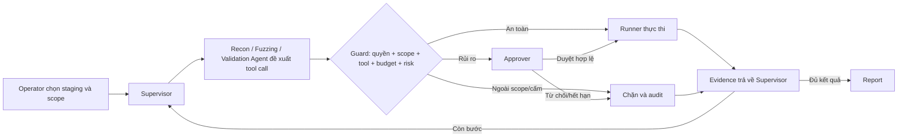

# PentestSyndicate

PentestSyndicate là đề tài VSOC-04 của nhóm P-077: một web app điều phối nhiều AI agent để hỗ trợ kiểm thử bảo mật trong môi trường staging hoặc lab đã được cấp phép. Operator tạo phiên kiểm tra; Supervisor điều phối Recon, Fuzzing và Validation Agent; Approver là con người quyết định trước hành động rủi ro; hệ thống tổng hợp bằng chứng và tạo báo cáo.

## Gate 1 — Chốt bài toán và thiết kế

Toàn bộ hồ sơ Gate 1 nằm tại:

**[Mở bộ hồ sơ Gate 1](docs/gate-1/README.md)**

| Deliverable | Link |
|---|---|
| One-page Brief | [docs/gate-1/01-one-page-brief.md](docs/gate-1/01-one-page-brief.md) |
| PRD | [docs/gate-1/02-prd.md](docs/gate-1/02-prd.md) |
| Wireframe & UI Flow | [docs/gate-1/03-wireframe-ui-flow.md](docs/gate-1/03-wireframe-ui-flow.md) |
| GitHub Repo & AI Log Setup | [docs/gate-1/04-github-ai-log-setup.md](docs/gate-1/04-github-ai-log-setup.md) |
| Checklist nộp Gate | [docs/gate-1/05-gate-submission-checklist.md](docs/gate-1/05-gate-submission-checklist.md) |

## Trạng thái hiện tại

Recon Day 1 đã có luồng thực thi từ task đến kết quả và bằng chứng; Day 2 bổ sung nền tảng discovery endpoint qua nhiều vòng xác định. FastAPI/LangGraph starter vẫn nằm trong repo; workflow nhiều agent, frontend, phân quyền, HITL và report thuộc thiết kế mục tiêu.

**Recon Day-1 backbone đã triển khai:**

- Hợp đồng dữ liệu có kiểu cho `ReconTask`, `ReconPlan` và `CapabilityRequest`.
- `PolicyService` từ chối mặc định các IP, cổng và capability ngoài scope.
- `ToolExecutionGateway` là điểm điều phối thực thi; `request_id` được claim nguyên tử trước policy và adapter để tránh chạy tool hai lần.
- Adapter HTTP probe, Nmap và WhatWeb với tham số cố định, giới hạn thực thi; parser Nmap/WhatWeb xác định.
- SQLite lưu task, execution claim, policy decision, tool result, metadata evidence và Recon result.
- `EvidenceStore` giới hạn kích thước và kiểm tra toàn vẹn SHA-256 khi đọc.
- `ReconPlanner` tạo plan xác định từ scope; `ReconAgent` chạy trực tiếp từ `task_id`.
- Test đầu cuối HTTP trên `127.0.0.1` đi qua Agent, Policy, Gateway, adapter, Evidence và Repository.

**Recon Day 2 đã triển khai:**

- Nhiều `ReconPlan` trong cùng task, giữ claim và idempotency theo từng request.
- `HTTP_FETCH` chỉ GET/HEAD, kiểm tra path/method scope, không theo redirect, có timeout và giới hạn body.
- Parser HTML, robots, sitemap/index, OpenAPI 3/Swagger 2 và JavaScript đơn giản; gộp endpoint và provenance theo quy tắc xác định.
- Lưu endpoint, parameters, discovery source, baseline và lifecycle `DISCOVERED → OBSERVED → BASELINED → FUZZ_READY`.
- Coverage, source status và điểm dừng theo giới hạn; test localhost nhiều nguồn kiểm tra cả replay và evidence.
- Tách route khỏi concrete observation: `/search?q=a` và `/search?q=b` là một route, hai observation; `/profile` có baseline hợp lệ có thể đạt `FUZZ_READY`.
- Shared `AttackSurfaceInventory` v1.0 trong `src/contracts`, có schema freeze và trace provenance → observation → request → evidence.
- `ToolRun` có lease/recovery: request đã hoàn tất được replay; claim hết lease thành `FAILED` bền vững, không tự chạy lại.
- Policy/Gateway enforce request budget, rate, timeout và body limit; reservation và policy decision được lưu nguyên tử trước dispatch.
- SQLite migration có version; evidence manifest có run/tool-run/kind/content type/redaction metadata.
- Registry chỉ đăng ký Nmap/WhatWeb khi tìm thấy binary; HTTP probe/fetch luôn có trong runner Python.

**Day 2 architecture: FROZEN; Recon → Fuzz contract: v1.0.** Request dùng `action_fingerprint` tách khỏi `request_id`, `Risk` là R0–R4; OpenAPI template có thể gộp path cụ thể khi khớp duy nhất. Python giữ **3.11** theo [ADR runtime](docs/adr/0001-mvp-python-runtime.md). [ADR Browser](docs/adr/0003-browser-execution-boundary.md) khóa đường thực thi và interception cho Day 03; [ADR pinned origin](docs/adr/0005-pinned-web-origins.md) bổ sung HTTP/Browser cho hostname. Product API/Supervisor chưa nối. Chi tiết handoff nằm trong tài liệu Day 2.

Xem [kiến trúc hiện tại](ARCHITECTURE.md) và [cách chạy, giới hạn Day 2](docs/day2-endpoint-discovery.md). Bộ kiểm tra gồm toàn bộ test Day 1 và các test Day 2; chạy bằng lệnh trong mục **Kiểm tra**.

## Vai trò

| Vai trò | Người hay AI | Trách nhiệm |
|---|---|---|
| Operator | Người | Chọn staging/scope, tạo và theo dõi run |
| Approver | Người | Duyệt hoặc từ chối action rủi ro |
| Supervisor | AI agent | Lập kế hoạch, điều phối, đối chiếu |
| Recon | AI agent | Khảo sát trong allowlist |
| Fuzzing | AI agent | Kiểm tra hữu hạn các điểm đã tìm thấy |
| Validation Agent | AI agent | Đề xuất bước kiểm chứng; không tự vượt approval |

## Workflow mục tiêu



## Nguyên tắc an toàn của MVP

- Chỉ chạy trên target lab/staging được cho phép.
- Deny by default với target ngoài allowlist.
- Mọi tool call qua permission/scope/tool/budget/risk guard; hành động rủi ro dừng trước khi chạy.
- Approval gắn với đúng run, target, action, parameter hash và thời hạn.
- Runner kiểm tra lại scope và approval ngay trước khi thực thi.
- Nội dung từ target được coi là dữ liệu không tin cậy.
- Finding phải có evidence và verification status.
- Không đưa dữ liệu cá nhân, secret hoặc dữ liệu nhạy cảm thật vào hệ thống.

## Chạy backend starter hiện tại

Yêu cầu: Python 3.11.

```powershell
py -3.11 -m venv .venv
.\.venv\Scripts\Activate.ps1
python -m pip install -r requirements.txt
Copy-Item .env.example .env
uvicorn src.main:app --reload --port 8000
```

Swagger UI: <http://localhost:8000/docs>

## Giao diện Recon local (một file)

```powershell
cd C:\VinAI\Agent_recon
.\.venv\Scripts\python.exe -m scripts.recon_ui
```

Mở **http://127.0.0.1:8765/**. Toàn bộ giao diện và server nằm trong
[`scripts/recon_ui.py`](scripts/recon_ui.py), dùng dependencies sẵn có.

1. Cấu hình Gemini (`GOOGLE_API_KEY` hoặc `GEMINI_API_KEY`, `GEMINI_MODEL`) trong `.env`.
2. Nhập domain hoặc IP của target được phép vào ô **Target**. Nút lab localhost là đường chạy tương thích URL.
3. Bấm **Start Recon**; cấu hình provider/model và profile cũ nằm trong Advanced configuration.
4. Xem Routes, Assets, Checklist, Manual review, Planning và Evidence; tải JSON và evidence đã kiểm tra SHA-256.

Lab tích hợp phục vụ HTML, robots, sitemap, OpenAPI, JavaScript và hidden paths;
không phục vụ thư mục repo. Lượt Recon gọi LLM thật và dùng quota của provider.
Browser/content discovery chỉ chạy khi runtime, planner và policy cho phép.
Profile IP mặc định dùng một bộ port nhỏ; chế độ IP/ports cũ còn trong Advanced configuration.
Capability thiếu runtime được hiển thị rõ trên giao diện.

Domain root dùng DNS quan sát có giới hạn và HTTP transport pin. Subdomain hợp lệ
chỉ được thêm sau khi có evidence và scope derivation xác định; bên thứ ba chỉ là
observation OUT_OF_SCOPE. Không tự theo redirect. Xem
[hỗ trợ domain và giới hạn](docs/recon-domain-support.md).

UI gọi nguyên runner `scripts.run_recon_live` qua subprocess, không gọi adapter
trực tiếp. Dữ liệu nằm tại `data/live-recon/<task-id>/`; mỗi lần chạy tạo task mới.
Tiến độ ToolRun/stage được đọc từ SQLite; inventory và planning đầy đủ được export
khi runner kết thúc. Giữ server UI chạy đến khi hoàn tất; đóng tab không hủy run.
Lịch sử của tiến trình không do phiên UI hiện tại quản lý được ghi `UNTRACKED`;
UI không tự retry/resume. API chỉ dành cho localhost và được bảo vệ bằng token phiên.
Đổi cổng bằng `--port 8766` nếu cần. `/health` của backend starter không cần chạy
để sử dụng giao diện này.

## Kiểm tra

Verified baseline `8295fea`: **309 tests PASS**, [remote CI PASS](https://github.com/htungf211004/Agent_recon/actions/runs/36514030963). The bounded adaptive update has **356 tests PASS, zero skips, Ruff PASS** locally. See the [current verification report](docs/recon-bounded-verification.md) for Docker gates and publication status. Changes remain local; this revision is not marked FROZEN.

```powershell
.\.venv\Scripts\python.exe -B -m ruff check --no-cache src tests scripts/check_recon_runtime.py
$env:RECON_REQUIRE_CHROMIUM = "1"
.\.venv\Scripts\python.exe -B -m pytest -p no:cacheprovider tests -q
```

## Recon Day 03 Ver02: passive browser discovery

`ReconAgent` now runs a deterministic `BrowserDiscovery` phase when the task allows `BROWSER_EXPLORE` and Chromium is available. Bounded BFS follows sorted same-origin anchors with page, depth, request, runtime and response/total byte limits. Fixed DOM reads collect links/forms; forms are never submitted. Browser observations merge into the existing `EndpointObservation`, template reconciliation and **AttackSurfaceInventory v1.0**, preserving verified Day 2 baselines.

The external-dispatch boundary is preserved: every browser GET/HEAD needs a policy-authorized child ToolRun and one-use Gateway continuation permit. Stable page sequence distinguishes repeated resources across pages. A Chromium response guard blocks redirects before any follow-up request and rejects attachments, unbounded/compressed and oversized bodies. Child evidence is `http_exchange` with parent/resource/page metadata and document DOM provenance. Cancellation remains terminal; restart never repeats a completed or uncertain network dispatch.

Install Chromium locally for the real localhost integration gate:

```powershell
.\.venv\Scripts\python.exe -m playwright install chromium
.\.venv\Scripts\python.exe -m src.recon.browser_runtime --probe
$env:RECON_REQUIRE_CHROMIUM = "1"
.\.venv\Scripts\python.exe -m pytest -q tests/integration/test_recon_browser_local_e2e.py
```

CI installs Chromium and system dependencies, probes launch availability, and fails if browser tests cannot run. Local skipping is allowed only without the mandatory flag. The real E2E first proves a forbidden sink is reachable, then checks zero off-scope dispatch, BFS, evidence, baseline preservation, cancellation and restart. See the [Day 03 guide](docs/day3-browser-discovery.md), [browser architecture](ARCHITECTURE.md#day-03-ver02-passive-browser-discovery) and [ADR 0003](docs/adr/0003-browser-execution-boundary.md) for configuration and response-admission limits.

## Recon final hardening

- Browser inventory only projects `document`, `xhr`, `fetch`; assets retain policy, ToolRun and evidence.
- Child execution identity includes resource type; persisted Ver01/Ver02 runs remain replayable.
- Browser root falls back to `/`; empty path prefixes mean no extra path restriction on the authorized target.
- ReconCoverage exposes browser completion, stop reasons and limitations separately from static discovery.
- Playwright is pinned to **1.63.0**. Docker installs matching Chromium and runs as non-root; CI includes container probe and FastAPI smoke checks.
- AST tests reject Playwright imports/browser operations in Agent/planning/business logic and unapproved process execution.

See [final hardening verification](docs/recon-final-hardening.md) and [container instructions](docs/day3-browser-discovery.md#container-gate).

## Recon final P0

- `ReconAgent` chạy `BrowserBaselinePromotion` sau passive browser discovery. Browser-observed GET/HEAD hợp lệ được chọn xác định, rồi baseline bằng một request `HTTP_FETCH` riêng qua Policy/Gateway.
- Chỉ complete 2xx evidence hợp lệ mới tạo `BaselineRequest` và đạt `FUZZ_READY`; giữ browser provenance, không tạo fake discovery source. Restart không gửi lại baseline hoặc đổi concrete URL đã chọn.
- Trusted task snapshot dùng `recon-3.0`; migration v6 gắn `recon-2.2` cho task cũ. Completed request cũ vẫn replay đúng fingerprint; action mới trên policy cũ bị DENY.
- Final container manifest requires six public capabilities, including bounded `content_discovery`; `browser_request` remains internal.
- Xem [báo cáo P0 và các gate](docs/recon-final-p0.md).

## Bounded adaptive Recon worker

`AdaptiveReconAgent` performs sequential service discovery, HTTP verification, technology fingerprinting and static discovery before bounded LLM planning. Browser runs only after a persisted validated proposal. All execution passes through Policy/Gateway and produces durable evidence.

The model proposes scoped HTTP verification, passive Browser exploration, trusted-wordlist `CONTENT_DISCOVERY`, or an exclusive typed STOP. A curated checklist provides coverage gaps without granting permissions. Default planning is two rounds, hard maximum three, with at most eight accepted adaptive root actions.

```powershell
python -m scripts.run_recon_live --target-ip 127.0.0.1 --ports 8000,8080 --provider gemini --browser --content-discovery
```

Use only an authorized lab/staging target. The primary command is
`python -m scripts.run_recon_live --target example.test` (or a literal IPv4/IPv6
address). `--url` and `--target-ip` remain compatibility paths. V2 records an
immutable root, evidence-backed discovered assets, bounded derived host bindings,
checklist STT 1–16, and a provider-neutral RAG boundary. LLM and RAG never grant
scope. Active API security testing is manual/HITL. See
[domain support](docs/recon-domain-support.md).

Migration v9 adds root authorization, DNS observations, derived bindings and discovered assets. The runner exports ASI v1.0 and companion V2 audit artifacts. Worker completion is separate from `handoff_ready`; zero FUZZ_READY entries never justify a future FuzzTask.

See the [guide](docs/recon-bounded-adaptive.md), [examples](docs/recon-bounded-examples.json), [PT_01 source mapping](docs/recon-checklist-source-mapping.md), and [verification](docs/recon-bounded-verification.md).

## AI usage logging

Mỗi thành viên phải dùng `AI_LOG_API_KEY` riêng, lưu trong file `.env` cục bộ và cài hook sau khi clone:

```powershell
powershell -ExecutionPolicy Bypass -File scripts\setup_hooks.ps1
Test-Path .git\hooks\pre-push
```

Không commit `.env` hoặc `.ai-log/*.jsonl`. Hướng dẫn và checklist cho bốn người nằm tại [GitHub Repo & AI Log Setup](docs/gate-1/04-github-ai-log-setup.md).

## Cấu trúc chính

```text
docs/gate-1/       Hồ sơ Gate 1
src/recon/         Recon Day 1/2, discovery, policy, gateway, adapter và storage
src/contracts/     Shared Attack Surface v1.0 và EvidenceManifest
src/storage/       SQLite migration authority
src/               FastAPI và LangGraph starter
tests/             Unit test và HTTP localhost E2E
scripts/           AI log hooks và utilities
eval/              Nơi lưu bằng chứng evaluation
presentation/      Slide và video demo
docs/guide/        Technical Guidebook của chương trình
```

Không chỉnh `docs/guide` cho deliverable của đội; đây là nguồn Technical Book dùng chung.

## Tài liệu chương trình

Technical Guidebook: <https://phoenix.note.transformerlabs.ai/technical-book>

## License

[MIT](LICENSE)
