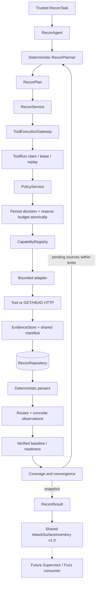
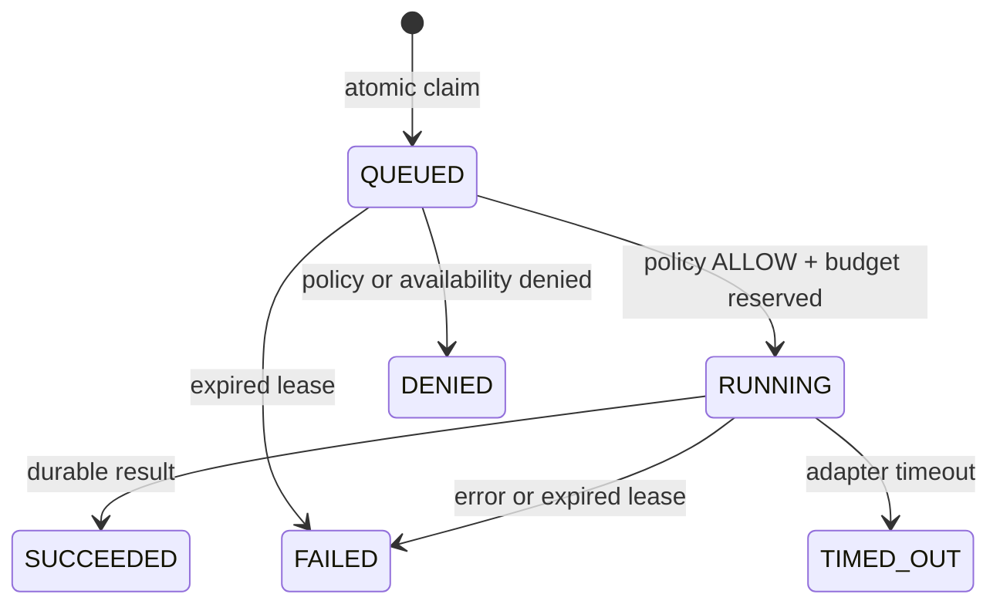

# Implemented Recon architecture — Day 2 freeze

Python 3.11. See [architecture decisions](../ARCHITECTURE.md) and the [shared handoff contract](day2-endpoint-discovery.md).

Terminal results replay without adapter execution. Lease expiry produces a durable failure; it does not authorize another network call. Readiness and coverage are derived from verified evidence, and can be revoked when evidence or required-input information changes.

The product FastAPI/Supervisor handoff is not wired yet. Hostname dispatch needs trusted authority/IP/SNI configuration before a domain-based lab. No LLM, LangGraph or vector store participates in the current Recon execution path.

Execution identity and template rules are recorded in [ADR 0002](adr/0002-day02-execution-and-route-contracts.md). [ADR 0003](adr/0003-browser-execution-boundary.md) freezes the future Browser interception path and cancellation gate.
