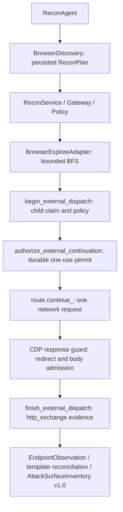

# Recon Day 03 Ver02

Passive browser discovery extends the existing ReconAgent and shared AttackSurfaceInventory v1.0. Python remains 3.11; Playwright is pinned to the verified **1.63.0** release in requirements.txt, CI and Docker.

## Run and verify

```powershell
.venv\Scripts\python.exe -m playwright install chromium
.venv\Scripts\python.exe -m src.recon.browser_runtime --probe
$env:RECON_REQUIRE_CHROMIUM = "1"
.venv\Scripts\python.exe -m pytest -q tests/integration/test_recon_browser_local_e2e.py
.venv\Scripts\python.exe -m ruff check src tests
.venv\Scripts\python.exe -m pytest -q tests
```

CI uses `playwright install --with-deps chromium`, a launch probe and the mandatory test flag. A missing runtime fails CI. Local tests can skip Chromium when the flag is absent; production composition advertises BROWSER_EXPLORE only after a bounded successful launch probe.

Trusted tasks must allow both `BROWSER_EXPLORE` and `BROWSER_REQUEST`, GET, literal target IPs, ports and path prefixes. BrowserDiscovery is entered only when BROWSER_EXPLORE is allowed and available. Missing child authorization still denies every child before network continuation.

```python
from src.recon.agent import ReconAgent
from src.recon.models import BrowserLimits
from src.recon.planner import ReconPlanner

agent = ReconAgent(repository, ReconPlanner(), service, browser_limits=BrowserLimits(
    max_pages=8, max_depth=2, max_requests=32, max_runtime_seconds=10,
    max_total_bytes=1048576, max_response_bytes=65536,
))
result = agent.run(task_id)
inventory = result.attack_surface_inventory
```

## Deterministic planning and limits

The first sorted in-scope discovery seed (or allowed path, otherwise `/`) is used as the root for each sorted IP/port origin. Empty path prefixes mean all validated paths on the authorized target; explicit prefixes still restrict paths. Scheme uses the existing port heuristic. The whole phase plan is persisted before execution. Restarts reuse that plan even if caller defaults change. Each parent's browser context is fresh; each page closes before the next one begins.

| Limit | BrowserDiscovery default | Hard maximum |
|---|---:|---:|
| max_pages | 8 | 16 |
| max_depth | 2 | 5 |
| max_requests | 32 | 64 |
| max_runtime_seconds | 10 | 30 |
| max_total_bytes | 1 MiB | 8 MiB |
| max_response_bytes | 64 KiB | 128 KiB |

Limits apply per BROWSER_EXPLORE parent; task request/rate budgets additionally apply across all parents and phases. Runtime/body limits are clamped to the trusted task budget. Direct BrowserExploreParams defaults retain Ver1's single page and depth zero. All new fields participate in action fingerprints when nondefault; legacy defaults serialize compatibly with stored Ver1 requests.

BFS normalizes and sorts anchors, deduplicates scheduled pages, obeys path scope and depth, and bounds the queue by max_pages. It never submits a form, including GET forms, or clicks a button. Downloads, cross-origin anchors, unplanned navigation, popups/frames, service workers and WebSocket server traffic are blocked. Uninterceptable worker requests are aborted.

## Execution and evidence



New child identities include parent, method, normalized URL, stable page sequence and resource type, with a versioned hash. Script and fetch requests for the same URL on the same page get separate IDs/fingerprints; identical requests with the same resource type cannot acquire another continuation. Stored Ver01/Ver02 IDs and payloads are not rewritten, and completed/uncertain parents do not redispatch. Route identity still excludes query values and browser resource type. No HTTP_FETCH is issued for a browser interception.

The response guard rejects redirects before Chromium can follow them. It admits only body lengths known from an explicit Content-Length, with identity encoding and no Transfer-Encoding. Each admitted body is charged against the response/total budget before continuation. HEAD/204/205 have no body charge. Unknown lengths, compression, oversized bodies and attachments fail closed. This bounds admitted response bodies, not TCP bytes or headers already buffered by Chromium.

Every child response envelope is `http_exchange` evidence with parent/resource/page metadata. Bodies are not retained and nonempty GET responses are marked truncated. `transfer_complete` records whether the transfer completed. DOM extraction reads only bounded link/form metadata in an isolated world using fixed source code, with no input values; its JSON is retained in the document exchange evidence. DOM payloads over min(64 KiB, max_response_bytes) are discarded and reported. Navigation URLs/depths, request count, byte count and stop reason are recorded in parent evidence.

Observed responses and discovered links/forms use the existing endpoint models. Provenance is merged and declared templates reconciled. Browser observations preserve earlier HTTP baseline proof. After browser discovery, `BrowserBaselinePromotion` can select a successful evidenced GET/HEAD observation for a separate deterministic `HTTP_FETCH` when allowed. Only its complete verified 2xx response can create a baseline and qualify for FUZZ_READY. Browser headers-only evidence never qualifies directly. Projection is idempotent and can be repaired from evidence after a crash.

Promotion selects the first eligible concrete URL in lexical order per route, with GET before HEAD, and persists its plan before dispatch. Forms/manual inputs, writes, unresolved required parameters, non-2xx or truncated responses never qualify. Current scope, policy version, expiry and budgets remain enforced by the Gateway. Old browser provenance is retained alongside the HTTP baseline. Promotion does not create static discovery sources or inflate discovery rounds. Reopening the database replays the same request with zero additional network dispatch. New tasks use `recon-3.0`; migration v6 preserves `recon-2.2` replay while denying new actions on old task snapshots.

Only `document`, `xhr` and `fetch` responses project into endpoint observations and inventory. Script/CSS/image/font/manifest traffic keeps its ToolRun, policy and evidence. The filter is applied again on evidence replay. CDP `Network.requestWillBeSent` and the Fetch pause's `networkId` correlate response resource semantics; URL alone is insufficient when a script and fetch share a URL.

Cancellation is terminal and durable. Every route/navigation checks parent state and deadline. Late completion cannot overwrite a CANCELLED child or create replacement evidence. Restart replays stored results; expired leases become failures with no automatic redispatch.

## Coverage and limitations

ReconCoverage retains static convergence separately and exposes browser availability/configuration, run count, completion, stop reasons and limitations. All configured parents must succeed with verified `converged` summaries for `browser_complete=True`. Request/depth/page/byte/DOM/runtime limits or errors make browser and aggregate completion false even after static discovery converges. Repeated snapshots and restarts preserve those limitations. No new persisted RunStatus is introduced.

If browser was not requested, it contributes no failure. If requested but unavailable with no prior run, it is not configured and `browser:unavailable` records the omitted phase; static completeness is preserved. Consumers should inspect `limitations` as well as aggregate completion. Convergence describes the bounded supported discovery queue, not exhaustive application coverage.

## Container gate

```powershell
docker build -t agent-recon-final .
docker run --rm agent-recon-final python -m src.recon.browser_runtime --probe
docker run --rm agent-recon-final nmap --version
docker run --rm agent-recon-final whatweb --version
docker run --rm agent-recon-final python -m scripts.check_recon_runtime
docker run --rm agent-recon-final python -c "import os; assert os.getuid() != 0"
docker run --detach --rm --name recon-final-smoke -e APP_ENV=test agent-recon-final
docker exec recon-final-smoke python -c "import json, urllib.request; assert json.load(urllib.request.urlopen('http://127.0.0.1:8000/health', timeout=5))['status'] == 'ok'"
docker stop recon-final-smoke
```

The image executes as `appuser`. `/opt/venv` avoids inaccessible root-only Python packages; `/ms-playwright` contains the browser revision selected by the pinned package. Nmap and WhatWeb are installed in the final stage. CI requires all five public capabilities, real localhost adapter execution through the Gateway, a WhatWeb redirect sink check, a non-root Chromium probe and the default FastAPI command's health endpoint. Missing binaries fail the final-image gate.

The localhost gate tests real forbidden-sink reachability followed by zero off-scope dispatch, redirects, writes, BFS bounds, repeated resources, DOM provenance, template merging, Day 2 baseline preservation, cancellation and restart. Browser-Use, CVE/RAG, Fuzzing, Validation, Approval and Finding logic are outside this implementation.
