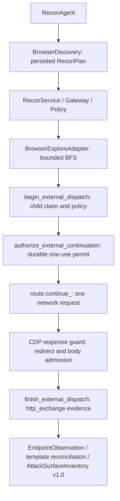

# Recon Day 03 Ver02

Passive browser discovery extends the existing ReconAgent and shared AttackSurfaceInventory v1.0. Python remains 3.11.

## Run and verify

```powershell
.venv\Scripts\python.exe -m playwright install chromium
.venv\Scripts\python.exe -m src.recon.browser_runtime --probe
$env:RECON_REQUIRE_CHROMIUM = "1"
.venv\Scripts\python.exe -m pytest -q tests/integration/test_recon_browser_local_e2e.py
.venv\Scripts\python.exe -m ruff check src tests
.venv\Scripts\python.exe -m pytest -q tests
```

CI uses `playwright install --with-deps chromium`, a launch probe and the mandatory test flag. A missing runtime fails CI. Local tests can skip Chromium when the flag is absent; production composition advertises BROWSER_EXPLORE only after a bounded successful launch probe.

Trusted tasks must allow both `BROWSER_EXPLORE` and `BROWSER_REQUEST`, GET, literal target IPs, ports and path prefixes. BrowserDiscovery is entered only when BROWSER_EXPLORE is allowed and available. Missing child authorization still denies every child before network continuation.

```python
from src.recon.agent import ReconAgent
from src.recon.models import BrowserLimits
from src.recon.planner import ReconPlanner

agent = ReconAgent(repository, ReconPlanner(), service, browser_limits=BrowserLimits(
    max_pages=8, max_depth=2, max_requests=32, max_runtime_seconds=10,
    max_total_bytes=1048576, max_response_bytes=65536,
))
result = agent.run(task_id)
inventory = result.attack_surface_inventory
```

## Deterministic planning and limits

The first sorted in-scope discovery seed (or allowed path) is used as the root for each sorted IP/port origin. Scheme uses the existing port heuristic. The whole phase plan is persisted before execution. Restarts reuse that plan even if caller defaults change. Each parent's browser context is fresh; each page closes before the next one begins.

| Limit | BrowserDiscovery default | Hard maximum |
|---|---:|---:|
| max_pages | 8 | 16 |
| max_depth | 2 | 5 |
| max_requests | 32 | 64 |
| max_runtime_seconds | 10 | 30 |
| max_total_bytes | 1 MiB | 8 MiB |
| max_response_bytes | 64 KiB | 128 KiB |

Limits apply per BROWSER_EXPLORE parent; task request/rate budgets additionally apply across all parents and phases. Runtime/body limits are clamped to the trusted task budget. Direct BrowserExploreParams defaults retain Ver1's single page and depth zero. All new fields participate in action fingerprints when nondefault; legacy defaults serialize compatibly with stored Ver1 requests.

BFS normalizes and sorts anchors, deduplicates scheduled pages, obeys path scope and depth, and bounds the queue by max_pages. It never submits a form, including GET forms, or clicks a button. Downloads, cross-origin anchors, unplanned navigation, popups/frames, service workers and WebSocket server traffic are blocked. Uninterceptable worker requests are aborted.

## Execution and evidence



Child identity includes parent, method, normalized URL and stable page sequence. Repeated resources across pages have distinct request IDs/fingerprints; duplicate requests within a page cannot acquire another continuation. No HTTP_FETCH is issued for a browser interception.

The response guard rejects redirects before Chromium can follow them. It admits only body lengths known from an explicit Content-Length, with identity encoding and no Transfer-Encoding. Each admitted body is charged against the response/total budget before continuation. HEAD/204/205 have no body charge. Unknown lengths, compression, oversized bodies and attachments fail closed. This bounds admitted response bodies, not TCP bytes or headers already buffered by Chromium.

Every child response envelope is `http_exchange` evidence with parent/resource/page metadata. Bodies are not retained and nonempty GET responses are marked truncated. `transfer_complete` records whether the transfer completed. DOM extraction reads only bounded link/form metadata in an isolated world using fixed source code, with no input values; its JSON is retained in the document exchange evidence. DOM payloads over min(64 KiB, max_response_bytes) are discarded and reported. Navigation URLs/depths, request count, byte count and stop reason are recorded in parent evidence.

Observed responses and discovered links/forms use the existing endpoint models. Provenance is merged and declared templates reconciled. Browser observations preserve earlier HTTP baseline proof; newly observed routes do not automatically become BASELINED or FUZZ_READY. Projection is idempotent and can be repaired from child evidence after a crash.

Cancellation is terminal and durable. Every route/navigation checks parent state and deadline. Late completion cannot overwrite a CANCELLED child or create replacement evidence. Restart replays stored results; expired leases become failures with no automatic redispatch. Coverage remains the existing Recon coverage, with updated inventory counts; browser stop details are in parent evidence and do not imply exhaustive application coverage.

The localhost gate tests real forbidden-sink reachability followed by zero off-scope dispatch, redirects, writes, BFS bounds, repeated resources, DOM provenance, template merging, Day 2 baseline preservation, cancellation and restart. Browser-Use, CVE/RAG, Fuzzing, Validation, Approval and Finding logic are outside this implementation.
