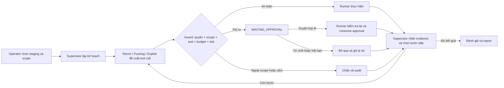
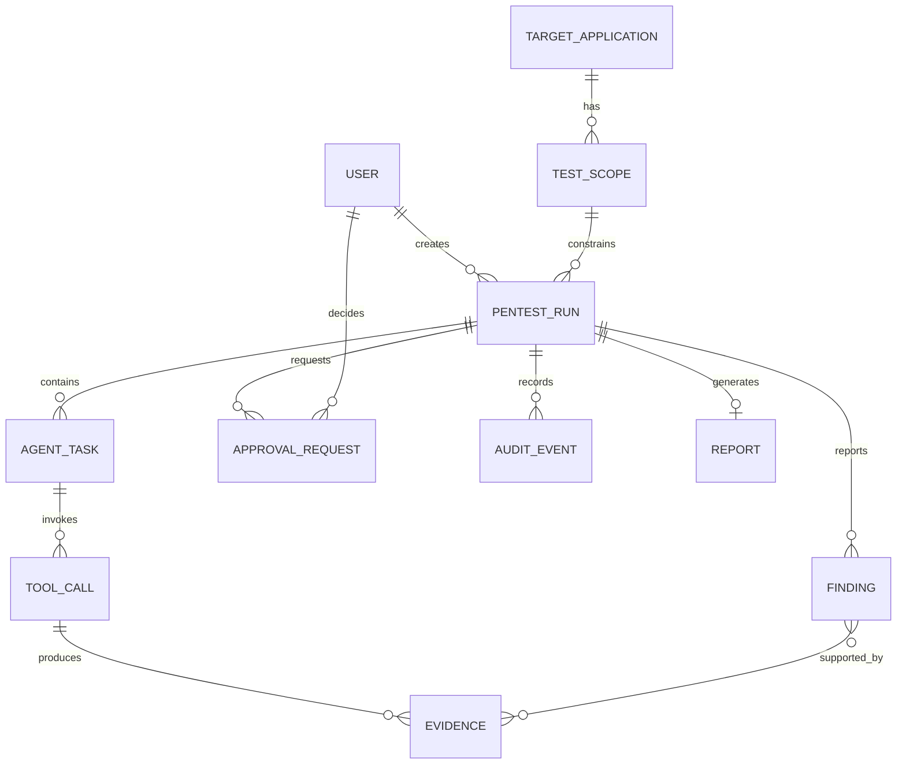
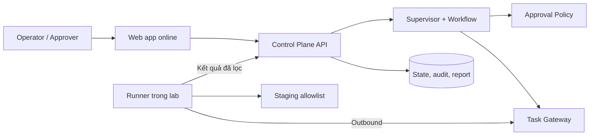

# PRD — PentestSyndicate

| Thuộc tính | Giá trị |
|---|---|
| Phiên bản | Gate 1 — 1.0, ngày 20/09/2026 |
| Trạng thái | Bản đề xuất cần nhóm và mentor xác nhận |
| Chủ sở hữu | PM / Supporting BA và BA chính |
| Sản phẩm | Web app điều phối quy trình kiểm thử bảo mật bằng nhiều AI agent, có con người kiểm soát |

## 1. Cách đọc tài liệu

- **Dữ kiện:** Có căn cứ từ đề bài hoặc trạng thái repo P-077.
- **Giả định:** Được dùng để tiếp tục thiết kế khi chưa có thông tin chính thức.
- **Đề xuất cần xác nhận:** Phương án nhóm đề xuất; chỉ trở thành quyết định sau khi mentor hoặc nhóm chốt.

### 1.1 Thuật ngữ

| Thuật ngữ | Giải thích trong dự án |
|---|---|
| HITL | Human-in-the-loop: con người phải ra quyết định tại điểm kiểm soát |
| Scope / allowlist | Tập target, cổng, path, method và loại kiểm tra được phép |
| Finding | Một phát hiện bảo mật cần đánh giá và dẫn bằng chứng |
| Evidence | Dữ liệu có thể đối chiếu để hỗ trợ hoặc bác bỏ finding |
| Runner | Thành phần trong lab thực thi tool sau khi kiểm tra policy |
| Trace | Dòng thời gian state, task, tool call, quyết định và lỗi của một run |
| Action risk | Rủi ro của hành động sắp thực hiện; dùng để quyết định HITL |
| Finding severity | Mức ảnh hưởng của lỗ hổng đã phát hiện; không dùng để cấp quyền chạy action |
| Action fingerprint | Dấu vân tay của action đã chuẩn hóa, dùng để bind approval |
| Idempotency | Cơ chế chống xử lý lặp cùng một yêu cầu; không chứng minh target chưa thực hiện khi timeout |

## 2. Hiện trạng repo P-077

### 2.1 Đã có

- FastAPI với `GET /health`, `GET /api/v1/status` và `POST /api/v1/chat`.
- LangGraph mẫu gồm hai node `analyze` và `respond`.
- Cấu trúc agent state, tool mẫu, Pydantic settings, Docker và Docker Compose.
- Workflow GitHub Actions được cấu hình để chạy Ruff và pytest trên Python 3.11; kết quả run từ xa cần kiểm tra trên PR.
- Script và hook ghi AI usage log.
- Khung architecture, worklog, journal và evaluation.
- Tại thời điểm lập tài liệu: Ruff pass và 5/5 test mẫu pass.

### 2.2 Chưa có

- Supervisor, Recon Agent, Fuzzing Agent hoặc Validation Agent.
- Frontend, đăng nhập hoặc phân quyền Operator/Approver.
- Database nghiệp vụ, quản lý staging/scope, workflow phê duyệt HITL.
- Công cụ pentest hoặc lab đã kết nối.
- Lưu bằng chứng, audit trail, báo cáo và evaluation thực tế.
- Cơ chế chặn target ngoài scope tại execution layer.

Vì vậy, nội dung từ phần 3 trở đi là thiết kế TO-BE cho MVP, không phải mô tả chức năng đã triển khai.

## 3. Tổng quan sản phẩm

### 3.1 Vấn đề

**Dữ kiện từ đề bài:** Một đợt pentest cần nhiều chuyên gia phối hợp ở các bước trinh sát, dò tìm, kiểm chứng và tổng hợp báo cáo. Công việc tốn công điều phối và có thể tạo rủi ro nếu một hành động vượt khỏi phạm vi được phép.

**Giả định cần kiểm chứng:** Kết quả và quyết định hiện nằm ở nhiều người hoặc công cụ, khiến trạng thái, bằng chứng và lý do ra quyết định khó theo dõi trong một luồng thống nhất.

### 3.2 Tuyên bố sản phẩm

PentestSyndicate là web app cho phép Operator chọn ứng dụng staging và phạm vi được phép. Supervisor AI điều phối Recon, Fuzzing và Validation Agent. Hành động rủi ro phải dừng trước khi thực thi để Approver là con người ra quyết định. Hệ thống lưu trạng thái, bằng chứng, lỗi và tạo báo cáo có thể đối chiếu.

Sản phẩm không nhằm thay thế pentester hoặc tự động khai thác mục tiêu tùy ý.

### 3.3 Giá trị dự kiến

- Cho Operator quan sát toàn bộ tiến trình trong một luồng.
- Gắn phát hiện với bằng chứng, nguồn và trạng thái xác minh.
- Chặn hành động ngoài scope hoặc chưa được duyệt.
- Cung cấp đủ ngữ cảnh để Approver quyết định.
- Tạo báo cáo nhất quán, nêu rõ lỗi và giới hạn.

Mọi tuyên bố về mức tiết kiệm thời gian hoặc tăng chất lượng chỉ được dùng sau khi có kết quả đo.

## 4. Người dùng và thành phần

| Vai trò | Loại | Mục tiêu |
|---|---|---|
| Operator | Con người | Chọn staging, khai báo scope, tạo và theo dõi run, xem báo cáo |
| Approver | Con người | Xem target, action, tham số, rủi ro và evidence để duyệt/từ chối |
| Security Reviewer | Stakeholder, không phải role MVP riêng | Đọc report qua quyền Operator hoặc Approver được cấp |
| Supervisor | AI agent | Lập kế hoạch, giao việc, đối chiếu kết quả, điều phối trạng thái |
| Recon | AI agent | Khảo sát hữu hạn trong scope |
| Fuzzing | AI agent | Kiểm tra các điểm Recon tìm thấy bằng tool được cấp |
| Exploit | AI agent | Đề xuất bước kiểm chứng và rủi ro; không tự vượt cổng phê duyệt |

Operator không phải AI. Operator và Approver là hai vai trò người dùng riêng; đề xuất MVP không cho Operator tự duyệt run do mình khởi tạo.

Baseline an toàn cho MVP là mỗi tài khoản chỉ có một role. Nếu sau này một người có nhiều role, backend vẫn phải kiểm tra `approver_user_id != operator_user_id` cho từng run.

## 5. Mục tiêu và ngoài phạm vi

### 5.1 Mục tiêu MVP

1. Web app deploy online, có ít nhất hai vai trò Operator và Approver.
2. Workflow có trạng thái: Recon → Fuzzing → đối chiếu → đề xuất kiểm chứng → phê duyệt → báo cáo.
3. Bốn AI agent có trách nhiệm và đầu ra riêng.
4. Tool chỉ được gọi trên mục tiêu và phạm vi đã khai báo.
5. Hành động rủi ro dừng thật tại execution layer trước khi chạy.
6. Lưu trạng thái, quyết định, bằng chứng, lỗi và kết quả.
7. Có happy path, failure cases và bộ evaluation cơ bản.
8. Theo dõi độ trễ, lỗi và số lần gọi tool/LLM.

### 5.2 Không thuộc MVP

- Kiểm thử production hoặc mục tiêu chưa được cấp phép.
- Mở rộng target ngoài allowlist.
- Tự thực hiện hành động rủi ro khi thiếu phê duyệt.
- Hỗ trợ mọi giao thức và mọi loại lỗ hổng.
- Nền tảng thương mại đa khách hàng, thanh toán hoặc marketplace tool.
- Huấn luyện mô hình riêng.
- RAG/GraphRAG khi chưa có nguồn tri thức và trường hợp sử dụng rõ.
- Lưu dữ liệu cá nhân, secret hoặc dữ liệu nhạy cảm thật.

## 6. Quy trình AS-IS và TO-BE

### 6.1 AS-IS — giả định cần kiểm chứng

1. Người thực hiện xác định mục tiêu.
2. Các chuyên gia/công cụ làm Recon, Fuzzing và kiểm chứng riêng.
3. Kết quả được trao đổi thủ công.
4. Người phụ trách quyết định bước rủi ro.
5. Bằng chứng và báo cáo được tổng hợp sau khi chạy.
6. Lỗi, kết quả mâu thuẫn hoặc bước chưa xác minh khó truy vết.

### 6.2 TO-BE — đề xuất

1. Operator đăng nhập và chọn staging đã đăng ký.
2. Operator khai báo scope, thời gian và profile kiểm tra.
3. Backend kiểm tra quyền, allowlist và kết nối runner.
4. Supervisor tạo kế hoạch và giao Recon.
5. Trước mọi tool call của Recon, Fuzzing hoặc Exploit, runner chuẩn hóa target/arguments rồi kiểm tra quyền, scope, tool, budget, rate limit và action risk.
6. Action bị cấm hoặc ngoài scope bị từ chối. Action an toàn mới được chạy; action rủi ro chuyển sang `WAITING_APPROVAL` trước khi chạy.
7. Recon thực hiện các call được phép, lưu evidence và trả output theo schema.
8. Supervisor chọn điểm phù hợp; Fuzzing cũng đi qua cùng policy guard trước từng tool call.
9. Supervisor đối chiếu, đánh dấu dữ liệu mâu thuẫn hoặc thiếu căn cứ.
10. Exploit đề xuất bước kiểm chứng; Exploit không tự phân quyền hay thực thi.
11. Nếu policy yêu cầu duyệt, Approver xem ngữ cảnh và duyệt hoặc từ chối.
12. Runner kiểm tra lại policy, scope và approval hiện hành ngay trước execution.
13. Nếu từ chối/hết hạn/sai fingerprint, bỏ qua hoặc tạo yêu cầu mới và ghi lý do.
14. Supervisor tổng hợp evidence, lỗi, giới hạn và tạo report.

## 7. Trạng thái và luồng ngoại lệ

### 7.1 Trạng thái run

Enum chuẩn dùng chung giữa backend, API và UI:

| Nhóm | Trạng thái |
|---|---|
| Khởi tạo | `DRAFT`, `VALIDATING_SCOPE`, `QUEUED` |
| Thực thi | `RECON_RUNNING`, `FUZZING_RUNNING`, `CORRELATING`, `PROPOSING_VALIDATION`, `VALIDATION_RUNNING`, `REPORTING` |
| Tạm dừng có điều kiện | `WAITING_APPROVAL`, `CANCEL_REQUESTED`, `UNKNOWN_OUTCOME` |
| Kết thúc | `COMPLETED`, `PARTIALLY_COMPLETED`, `FAILED`, `CANCELLED` |

`WAITING_APPROVAL` chỉ xuất hiện khi một tool call rủi ro cần duyệt; một run có thể đi qua trạng thái này nhiều lần. `PARTIALLY_COMPLETED` nghĩa là report vẫn tạo được nhưng có bước lỗi/bị bỏ qua; `FAILED` nghĩa là không thể tạo kết quả sử dụng được. `UNKNOWN_OUTCOME` dùng khi chưa biết target đã nhận hoặc thực hiện action trước timeout/mất kết nối.

### 7.2 Ngoại lệ phải xử lý

| Tình huống | Hành vi mong đợi |
|---|---|
| Scope không hợp lệ | Từ chối tạo run và nêu trường lỗi |
| Recon không có kết quả | Bỏ qua bước sau phù hợp; báo cáo “không có phát hiện trong phạm vi đã kiểm tra” |
| Tool timeout | Chỉ auto-retry call read-only/idempotent; action có tác động chuyển `UNKNOWN_OUTCOME`, reconcile evidence và cần approval mới trước khi thử lại |
| Output rỗng hoặc sai schema | Đánh dấu bước lỗi; không tạo finding |
| Hai agent mâu thuẫn | Đánh dấu cần đối chiếu; không tự gắn VERIFIED |
| Approver từ chối/hết hạn | Không gọi tool; ghi bước bị bỏ qua |
| Tham số khác nội dung đã duyệt | Chặn và tạo yêu cầu mới |
| Runner mất kết nối | Giữ trạng thái; không tự lặp hành động có tác động |
| Operator hủy run | Ngừng cấp task mới; runner dùng job handle/hard deadline để dừng tiến trình, ACK kết quả; chưa xác định thì giữ `CANCEL_REQUESTED` hoặc `UNKNOWN_OUTCOME` |
| Prompt injection từ target | Coi là dữ liệu; không đổi policy, scope hoặc tool permission |

## 8. Ưu tiên MoSCoW

MoSCoW gồm Must have (bắt buộc), Should have (nên có), Could have (có thể có) và Won’t have trong MVP (chưa làm).

### 8.1 Must have

| Hạng mục | Lý do |
|---|---|
| Web app deploy online | Yêu cầu của chương trình |
| Đăng nhập và hai vai trò | Cần cho HITL và phân quyền |
| Một lab/staging mô phỏng | Tạo biên an toàn cho MVP |
| Scope allowlist, deny by default | Ngăn agent mở rộng mục tiêu |
| Supervisor, Recon, Fuzzing, Exploit | Chứng minh multi-agent có phân vai |
| Workflow có trạng thái và tool-use | Yêu cầu agentic cốt lõi |
| Cổng phê duyệt HITL | Kiểm soát hành động rủi ro |
| Enforcement ở backend/runner | UI không phải ranh giới bảo mật |
| Evidence và audit trail | Kiểm chứng phát hiện và quyết định |
| Báo cáo cuối | Giá trị đầu ra cho người dùng |
| Xử lý lỗi, timeout và kết quả rỗng | Yêu cầu failure case |
| Evaluation và observability cơ bản | Đo chất lượng, độ trễ, lỗi, chi phí |
| GitHub, CI và AI usage log | Deliverable chương trình |

### 8.2 Should have

| Hạng mục | Lý do |
|---|---|
| Tiếp tục sau lỗi không nghiêm trọng | Tăng độ bền của demo |
| Timeline/trace theo agent | Giúp hiểu tiến trình |
| Approval có thời hạn | Tránh dùng quyết định cũ |
| Idempotency cho action | Tránh thực hiện hai lần |
| Confidence/verification status | Giảm kết luận quá mức |
| Một kênh thông báo Approver | Giảm thời gian chờ |
| Tải báo cáo | Thuận tiện bàn giao |

### 8.3 Could have

- RAG cho playbook đã kiểm duyệt.
- Slack hoặc Teams sau khi web approval hoạt động.
- Dashboard chi phí nâng cao, nhiều lab, so sánh nhiều run.
- Xuất PDF có thiết kế hoàn chỉnh.

### 8.4 Won’t have trong MVP

- Quét Internet hoặc production.
- Payload phá hủy dữ liệu, persistence hoặc mở rộng ngoài scope.
- Multi-tenant, marketplace, tự động sửa lỗ hổng.
- Tuyên bố tuân thủ tiêu chuẩn bảo mật chính thức.

## 9. Yêu cầu chức năng

| ID | Yêu cầu | Actor | Ưu tiên |
|---|---|---|---|
| FR-01 | Đăng nhập và xác định vai trò | Operator, Approver | Must |
| FR-02 | Kiểm tra quyền phía server cho thao tác nhạy cảm | Hệ thống | Must |
| FR-03 | Xem target/lab được phép | Operator | Must |
| FR-04 | Tạo run với target, scope, profile và thời hạn | Operator | Must |
| FR-05 | Từ chối target/tham số ngoài allowlist | Hệ thống | Must |
| FR-06 | Tạo kế hoạch từ scope hợp lệ | Supervisor | Must |
| FR-07 | Điều phối Recon, Fuzzing và Exploit theo trạng thái | Supervisor | Must |
| FR-08 | Mỗi agent trả output theo schema | Hệ thống | Must |
| FR-09 | Agent chỉ dùng tool được cấp cho vai trò | Hệ thống | Must |
| FR-10 | Ghi tool call, target, tham số đã lọc, thời gian, trạng thái, evidence ID | Hệ thống | Must |
| FR-11 | Xem trạng thái hiện tại và lịch sử bước | Operator | Must |
| FR-12 | Đối chiếu kết quả nhiều bước | Supervisor | Must |
| FR-13 | Tạo đề xuất kiểm chứng; không tự cho phép thực thi | Exploit | Must |
| FR-14 | Phân loại đề xuất có cần HITL | Policy engine | Must |
| FR-15 | Dừng run ở cổng phê duyệt trước tool call | Hệ thống | Must |
| FR-16 | Xem target, action, tham số, lý do, tác động, evidence và expiry | Approver | Must |
| FR-17 | Duyệt/từ chối kèm ghi chú | Approver | Must |
| FR-18 | Kiểm tra lại scope, quyền và approval ngay trước khi chạy | Runner | Must |
| FR-19 | Từ chối/hết hạn thì bỏ qua và ghi lý do | Hệ thống | Must |
| FR-20 | Retry hữu hạn cho lỗi được phép retry | Hệ thống | Must |
| FR-21 | Yêu cầu hủy run | Operator | Should |
| FR-22 | Tạo báo cáo hoàn chỉnh hoặc một phần | Hệ thống | Must |
| FR-23 | Gắn finding với evidence ID | Hệ thống | Must |
| FR-24 | Phân biệt VERIFIED, SUSPECTED, NOT_VERIFIED | Hệ thống | Must |
| FR-25 | Xem audit trail theo quyền | Operator, Approver | Must |
| FR-26 | Ghi số lần gọi, lỗi, độ trễ và usage nếu có | Hệ thống | Must |
| FR-27 | Che secret trong log, evidence và report | Hệ thống | Must |
| FR-28 | Thông báo yêu cầu duyệt qua một kênh | Hệ thống | Should |

## 10. Yêu cầu phi chức năng

Các ngưỡng số học bên dưới là đề xuất ban đầu và phải được mentor xác nhận hoặc thay bằng baseline đo được.

| ID | Nhóm | Yêu cầu |
|---|---|---|
| NFR-01 | Security | Mọi tool call, bất kể agent tạo ra, qua permission/scope/tool/budget/risk policy trước khi chạy |
| NFR-02 | Security | AuthN/AuthZ kiểm tra phía server |
| NFR-03 | Security | Secret chỉ ở environment hoặc secret store |
| NFR-04 | AI safety | Nội dung target là dữ liệu không tin cậy, không được đổi system instruction |
| NFR-05 | Privacy | Che token, cookie, mật khẩu và dữ liệu nhạy cảm |
| NFR-06 | Network | Runner chỉ truy cập target allowlist; control channel do runner kết nối outbound |
| NFR-07 | Audit | State change, tool call và approval có timestamp và actor |
| NFR-08 | Reliability | Action có tác động dùng idempotency key; timeout không được tự suy ra là chưa thực hiện |
| NFR-09 | Reliability | Runner mất kết nối không được tự coi run là hoàn thành |
| NFR-10 | Performance | API/UI quản lý có p95 dưới 2 giây, không tính tool/LLM — đề xuất cần xác nhận |
| NFR-11 | Freshness | UI nhận trạng thái trong 5 giây sau khi backend ghi nhận — đề xuất cần xác nhận |
| NFR-12 | Demo | Happy path chạy hoàn chỉnh ba lần liên tiếp trước demo — tiêu chí nội bộ đề xuất |
| NFR-13 | Usability | UI có trạng thái loading, empty, error và next action rõ |
| NFR-14 | Maintainability | Agent, tool, API và policy tách lớp, có schema/type |
| NFR-15 | Testing | Business rule scope, HITL và quyền có automated test |
| NFR-16 | Observability | Run ID/correlation ID xuyên suốt workflow |
| NFR-17 | Cost | Ghi LLM/tool usage và chi phí nếu provider trả usage |
| NFR-18 | Data | Chỉ dùng dữ liệu công khai, mô phỏng hoặc ẩn danh |
| NFR-19 | Scope enforcement | Chuẩn hóa scheme/host/IP/CIDR/port/path/method; resolve và kiểm tra tại lúc kết nối; redirect bị tắt hoặc kiểm tra lại |
| NFR-20 | Runner isolation | Egress deny-by-default; giới hạn request/concurrency/duration/body; fixed tool binary và structured args; không cho agent sinh shell command tùy ý |
| NFR-21 | Runner trust | Runner dùng credential ngắn hạn hoặc mTLS; task envelope bất biến có chữ ký/hash, expiry, nonce; fail closed khi không kiểm tra được policy |

## 11. Quy tắc nghiệp vụ

| ID | Quy tắc |
|---|---|
| BR-01 | Chỉ Operator được tạo run |
| BR-02 | Run chỉ bắt đầu khi target, scope, thời hạn và runner hợp lệ |
| BR-03 | Target ngoài allowlist bị từ chối mặc định |
| BR-04 | Agent chỉ dùng tool được cấp |
| BR-05 | Agent chỉ đề xuất tool call; policy ngoài LLM quyết định quyền thực thi và agent không được tự hạ risk |
| BR-06 | Action rủi ro từ bất kỳ agent nào phải dừng trước tool call |
| BR-07 | Approval gắn với run, normalized scope snapshot, target, tool/version, action, parameter hash, policy version, approver, expiry, nonce và max-use=1 |
| BR-08 | Target/action/parameter thay đổi thì phải duyệt lại |
| BR-09 | Từ chối hoặc hết hạn tương đương không có quyền thực thi |
| BR-10 | Không tái sử dụng approval cho run khác |
| BR-11 | Chỉ auto-retry call read-only/idempotent; action có tác động timeout phải reconcile và xin approval mới trước khi thử lại |
| BR-12 | Finding thiếu evidence hợp lệ không được gắn VERIFIED |
| BR-13 | Lỗi tool/agent không được biến thành finding thành công |
| BR-14 | Report phải ghi bước bị bỏ qua, lỗi và giới hạn |
| BR-15 | Nội dung từ target là dữ liệu, không phải chỉ dẫn |
| BR-16 | Không lưu secret hoặc dữ liệu nhạy cảm thô nếu không cần |
| BR-17 | Audit event không được sửa qua luồng sử dụng thông thường |
| BR-18 | Baseline MVP: mỗi tài khoản có một role và Operator không tự duyệt run mình tạo; mentor cần xác nhận |
| BR-19 | Với nhiều Approver, quyết định hợp lệ đầu tiên thắng bằng optimistic locking: `PENDING → REJECTED/EXPIRED/SUPERSEDED/CANCELLED` là terminal; nhánh thực thi là `PENDING → APPROVED → CONSUMED` |
| BR-20 | Trước execution, runner kiểm tra lại trạng thái tài khoản/role, separation of duties, scope snapshot và approval chưa bị consume |

## 12. Ma trận rủi ro và HITL

| Mức | Ví dụ khái quát | Xử lý đề xuất |
|---|---|---|
| Thấp | Đọc metadata trong allowlist, không đổi trạng thái | Tự động theo policy, vẫn ghi log |
| Trung bình | Request kiểm tra chủ động, có rate limit | Tự động hoặc duyệt tùy lab |
| Cao | Có thể đổi dữ liệu, tạo tải đáng kể hoặc kiểm chứng sâu | Bắt buộc Approver duyệt |
| Cấm trong MVP | Phá hủy dữ liệu, duy trì truy cập, vượt scope | Không thực hiện, kể cả khi được yêu cầu qua UI |

Ma trận này phải được mentor xác nhận sau khi nhóm chốt tool và lab cụ thể.

Action risk trong bảng trên quyết định có cần HITL. Finding severity là mức ảnh hưởng của lỗ hổng trong report; hai giá trị độc lập và không được dùng thay cho nhau.

## 13. User story

| ID | User story |
|---|---|
| US-01 | Là người dùng, tôi muốn đăng nhập với đúng vai trò để chỉ thực hiện thao tác được cấp quyền. |
| US-02 | Là Operator, tôi muốn chọn staging và scope để tạo một đợt kiểm thử có kiểm soát. |
| US-03 | Là Operator, tôi muốn xem trạng thái từng agent để biết run đang ở đâu. |
| US-04 | Là người chịu trách nhiệm, tôi muốn chặn tool call ngoài scope để bảo vệ mục tiêu chưa được phép. |
| US-05 | Là Approver, tôi muốn xem action, tham số, lý do, tác động và evidence để quyết định. |
| US-06 | Là Approver, tôi muốn duyệt/từ chối và ghi lý do để hệ thống thực hiện đúng quyết định. |
| US-07 | Là Operator, tôi muốn biết bước nào lỗi và cách hệ thống xử lý để không nhầm lỗi thành kết quả. |
| US-08 | Là người dùng được cấp quyền đọc report, tôi muốn xem finding, evidence, verification status và giới hạn. |
| US-09 | Là Operator/Approver, tôi muốn xem audit trail để truy vết run. |
| US-10 | Là nhóm phát triển, tôi muốn chạy bộ ca cố định để so sánh chất lượng qua phiên bản. |

## 14. Tiêu chí nghiệm thu Given–When–Then

### AC-01 — Tạo run hợp lệ

**Given** Operator đã đăng nhập, target thuộc danh sách được phép, scope và thời hạn hợp lệ 
**When** Operator xác nhận tạo run 
**Then** hệ thống tạo run ID duy nhất, lưu người tạo và scope, rồi chuyển sang `QUEUED`.

### AC-02 — Từ chối target ngoài phạm vi

**Given** Operator đang tạo run 
**When** target hoặc scope không thuộc allowlist 
**Then** hệ thống không tạo run hoạt động, hiển thị lý do và ghi audit event.

### AC-03 — Theo dõi agent

**Given** run đang chạy 
**When** một agent bắt đầu hoặc kết thúc bước 
**Then** UI hiển thị tên bước, trạng thái, timestamp và evidence liên quan.

### AC-04 — Chặn tool ngoài scope

**Given** run có scope hợp lệ 
**When** agent yêu cầu tool gọi target ngoài scope 
**Then** runner chuẩn hóa URL/arguments, kiểm tra host/IP/port/path/method và chặn trước khi gửi request; redirect hoặc DNS resolution mới cũng phải kiểm tra lại và được audit.

### AC-05 — Chờ phê duyệt

**Given** Recon, Fuzzing hoặc Exploit đề xuất action được policy đánh dấu rủi ro 
**When** đề xuất được tạo 
**Then** run chuyển `WAITING_APPROVAL`, tool chưa được gọi và approval request có đủ ngữ cảnh.

### AC-06 — Duyệt hợp lệ

**Given** request đang chờ, chưa hết hạn và Approver đúng quyền 
**When** Approver phê duyệt 
**Then** hệ thống lưu quyết định và chuyển request sang `APPROVED`; ngay trước dispatch, runner kiểm tra scope/action/parameters/role rồi atomically claim `APPROVED → CONSUMED` cho đúng task. Nếu crash sau claim, hệ thống vào reconcile/`UNKNOWN_OUTCOME` và không tái sử dụng approval.

### AC-07 — Từ chối hoặc hết hạn

**Given** request đang chờ 
**When** Approver từ chối hoặc request hết hạn 
**Then** tool không được gọi, bước được đánh dấu bỏ qua và report ghi chưa kiểm chứng.

### AC-08 — Tham số thay đổi

**Given** action đã được duyệt 
**When** target, action hoặc tham số khác fingerprint đã duyệt 
**Then** hệ thống chặn và tạo approval mới nếu còn cần.

### AC-09 — Sự kiện lặp

**Given** action đã thực hiện thành công 
**When** nhận lại cùng approval event 
**Then** action không chạy lần hai và audit log ghi sự kiện trùng.

### AC-10 — Tool timeout

**Given** tool call đang chạy 
**When** vượt timeout 
**Then** hệ thống chỉ auto-retry nếu call được khai báo read-only/idempotent; với action có tác động, run chuyển `UNKNOWN_OUTCOME`, reconcile evidence và không thử lại nếu chưa có approval mới.

### AC-11 — Báo cáo có bằng chứng

**Given** run hoàn thành hoặc hoàn thành một phần 
**When** người dùng mở report 
**Then** mỗi finding có title, target, severity, verification status và evidence ID; bước lỗi/bỏ qua hiển thị rõ.

### AC-12 — Không rò rỉ secret

**Given** evidence chứa token, cookie hoặc chuỗi nhạy cảm 
**When** lưu hoặc hiển thị 
**Then** giá trị được che hoặc loại bỏ và report không chứa secret thô.

### AC-13 — Sai vai trò

**Given** Operator đăng nhập 
**When** gọi approval API 
**Then** backend trả lỗi không đủ quyền và workflow không đổi.

### AC-14 — Prompt injection từ target

**Given** phản hồi target chứa chỉ dẫn bỏ qua policy hoặc mở rộng mục tiêu 
**When** agent xử lý 
**Then** nội dung vẫn là dữ liệu; scope, permission và approval policy không đổi.

### AC-15 — Output agent sai schema

**Given** một agent hoàn thành bước xử lý 
**When** output thiếu trường bắt buộc hoặc sai schema 
**Then** hệ thống đánh dấu task lỗi, lưu error code, không tạo finding và hiển thị đúng node bị lỗi.

### AC-16 — Runner mất kết nối

**Given** run đang thực thi 
**When** runner mất kết nối trước khi xác nhận kết quả action 
**Then** hệ thống không tự báo thành công hoặc tự chạy lại; trạng thái chuyển `UNKNOWN_OUTCOME` và UI hiển thị last-seen cùng bước reconcile.

### AC-17 — Report không có finding

**Given** các bước trong scope đã hoàn thành nhưng không có finding hợp lệ 
**When** report được tạo 
**Then** report ghi “Không có phát hiện trong phạm vi đã kiểm tra”, vẫn chứa scope, các bước, lỗi và giới hạn; không tuyên bố ứng dụng không có lỗ hổng.

### AC-18 — Audit và observability

**Given** một run đi qua nhiều agent và tool 
**When** người có quyền mở audit trail 
**Then** mỗi state change, tool call, approval và error có run ID, actor, timestamp, outcome và latency/usage nếu có; dữ liệu nhạy cảm đã được che.

### AC-19 — Hủy run đang thực thi

**Given** run có một tool job đang chạy 
**When** Operator có quyền yêu cầu hủy 
**Then** hệ thống ngừng cấp task mới, gửi kill theo job handle/hard deadline và chờ ACK; nếu chưa xác định outcome thì giữ `CANCEL_REQUESTED` hoặc `UNKNOWN_OUTCOME`, không tự báo `CANCELLED`.

### 14.1 Ma trận truy vết yêu cầu

| Nhóm yêu cầu | Acceptance criteria | Eval case chính |
|---|---|---|
| FR-01–FR-02 Auth/RBAC | AC-01, AC-13 | Login đúng role; Operator gọi approval API |
| FR-03–FR-05 Target/scope | AC-01, AC-02, AC-04 | Target hợp lệ; ngoài scope; DNS/redirect đổi |
| FR-06–FR-09 Agent/tool permission | AC-03, AC-04, AC-15 | Stage transition; tool bị cấm; output sai schema |
| FR-10–FR-12 Trace/correlation | AC-03, AC-18 | Timeline đủ evidence; agent mâu thuẫn |
| FR-13–FR-19 HITL | AC-05–AC-09 | Action rủi ro từ Recon/Fuzzing/Exploit; duyệt, từ chối, expiry, đổi fingerprint, event lặp |
| FR-20 Retry/error | AC-10, AC-16 | Timeout read-only; timeout mutating; runner mất kết nối |
| FR-21 Cancel | AC-19 | Cancel khi job đang chạy và khi runner offline |
| FR-22–FR-24 Report | AC-11, AC-17 | Report có finding; report không có finding |
| FR-25–FR-26 Audit/metrics | AC-18 | Đủ run ID, actor, outcome, latency/usage |
| FR-27 Redaction | AC-12 | Evidence chứa secret giả |

## 15. Mô hình dữ liệu khái niệm

| Entity | Trường chính |
|---|---|
| User | id, name, email, role, status, created_at |
| TargetApplication | id, name, environment, base_url, allowed_hosts, allowed_ports, active |
| TestScope | id, target_id, normalized_hosts/IPs/CIDRs/ports/paths/methods, tool_allowlist, budgets, expires_at, prohibited_actions, policy_version |
| PentestRun | id, target_id, scope_id, operator_id, status, current_step, timestamps, summary |
| AgentTask | id, run_id, agent_type, status, attempt, timestamps, error |
| ToolCall | id, task_id, tool_name/version, normalized_target, sanitized_parameters, scope_snapshot_hash, approval_id, idempotency_key, status, latency |
| ApprovalRequest | id, run_id, requested_by, target, tool/version, action, parameter_hash, scope/policy hash, action_risk, status/version, expiry, nonce, decided_by/at, note, consumed_at |
| Evidence | id, run_id, task_id, tool_call_id, type, source, sanitized_reference, hash |
| Finding | id, run_id, title, affected_asset, severity, verification_status, evidence_ids |
| AuditEvent | id, run_id, actor, event_type, object, sanitized_details, created_at |
| Report | id, run_id, version, summary, scope_snapshot, finding_ids, limitations |

## 16. Báo cáo đầu ra

Report MVP gồm:

1. Run ID, thời gian và người khởi tạo.
2. Target và snapshot của scope.
3. Các bước đã làm, bị bỏ qua, bị từ chối hoặc lỗi.
4. Finding, severity và verification status.
5. Evidence ID và nguồn tool.
6. Quyết định phê duyệt liên quan.
7. Giới hạn của kết luận.
8. Thống kê thời gian, lỗi và số lần gọi tool/LLM.

Không lưu chuỗi suy luận nội bộ đầy đủ của model. Chỉ lưu tóm tắt quyết định, input/output có thể kiểm tra, tool call và evidence cần thiết.

## 17. Chỉ số và evaluation

Hiện chưa có baseline hoặc kết quả đo. Các chỉ số sau là đề xuất; không ghi “đã đạt” trước khi chạy eval.

### 17.1 An toàn

- Số action rủi ro chạy khi thiếu approval; mục tiêu bắt buộc bằng 0.
- Tỷ lệ case ngoài scope bị chặn; mục tiêu trên bộ test bằng 100%.
- Số action chạy lặp do retry/event; mục tiêu bằng 0.
- Số secret thô xuất hiện trong UI/report; mục tiêu bằng 0.

### 17.2 Chất lượng

- Precision, recall và false-positive rate trên bộ ca có nhãn.
- Tỷ lệ finding có evidence hợp lệ.
- Tỷ lệ finding được gắn đúng verification status.
- Tỷ lệ kết quả mâu thuẫn được đánh dấu thay vì tự kết luận.

Ngưỡng đạt cho precision/recall chỉ chốt sau baseline đầu tiên.

### 17.3 Vận hành

- Tỷ lệ run có report.
- Thời gian từ tạo run đến report và thời gian chờ approval.
- Tool error rate, agent/schema error rate, API latency.
- Số tool call/LLM call và chi phí ước tính mỗi run nếu có usage.

### 17.4 Bộ ca eval

- Happy path; không có finding; target ngoài scope.
- Action rủi ro do Recon, Fuzzing và Exploit đề xuất: duyệt, từ chối, hết hạn, đổi tham số.
- Approval event lặp; tool timeout; output rỗng; agents mâu thuẫn.
- Evidence chứa secret giả; target chứa prompt injection.
- Runner mất kết nối; sai vai trò gọi approval API.

## 18. Kiến trúc Hybrid SaaS

### 18.1 Đề xuất

**Control plane online:** Web UI, API, authentication/authorization, Supervisor, workflow state, approval, audit metadata và report đã lọc.

**Execution plane trong lab:** Một runner gọi tool, chỉ truy cập target allowlist, nhận task được xác thực và trả evidence đã lọc.

Runner chủ động mở long-poll/WebSocket outbound tới control plane để không cần mở inbound từ Internet vào lab. Task đi từ gateway tới runner trên kênh outbound đã được runner thiết lập.

Kênh này dùng mTLS hoặc credential runner ngắn hạn. Mỗi task envelope là bất biến và chứa run ID, normalized scope/policy hash, tool/version, structured arguments, expiry và nonce; gateway ký hoặc xác thực toàn vẹn, runner consume một lần và fail closed khi không kiểm tra được policy/approval. Result/evidence cũng phải xác thực nguồn runner.

Runner chạy tool cố định trong container không đặc quyền, không nhận shell command tùy ý từ agent. Egress firewall/proxy mặc định chặn và chỉ mở đúng target đã resolve; redirect, DNS resolution, port, protocol và budget được kiểm tra tại thời điểm kết nối.

### 18.2 Trade-off

- Phù hợp yêu cầu mạng lab và đặt network allowlist rõ hơn.
- Tăng thêm thành phần runner, xác thực, xử lý mất kết nối và đồng bộ state.
- MVP chỉ nên có một runner và một lab.

### 18.3 Cần mentor xác nhận

1. Mô hình này có đáp ứng “web/app deploy online” không?
2. Runner cần tách service/container đến mức nào trong MVP?
3. Cần demo những network/security control nào?
4. Web approval đã đủ hay bắt buộc Slack/Teams?

### 18.4 Baseline triển khai để hai dev bắt đầu

Đây là phương án mặc định của nhóm, có thể đổi sau mentor:

| Thành phần | Baseline đề xuất |
|---|---|
| Frontend | Next.js dashboard cho Operator/Approver |
| API/orchestrator | FastAPI và LangGraph, mở rộng starter hiện có |
| Auth | Hai tài khoản demo seed sẵn, password hash và session/JWT; chưa có Admin UI hoặc quên mật khẩu |
| Data | PostgreSQL cho bản online; SQLite chỉ dùng local nếu cần |
| Runner transport | Outbound long-poll trước; một runner, một lab |
| LLM | OpenAI-compatible qua service/config hiện có; model chọn bằng cấu hình |
| Target registry | Seed bằng config/migration; Operator không nhập host tùy ý |
| Deploy | Frontend và control-plane online; runner là container riêng gần lab; nhà cung cấp chưa chốt |

## 19. Rủi ro và giảm thiểu

| Rủi ro | Ảnh hưởng | Giảm thiểu |
|---|---|---|
| Scope quá lớn với 2 dev | Không hoàn thành luồng chính | Một lab, một runner, tool hữu hạn |
| Hai dev đều vibe code, thiếu ownership | Chồng chéo, khó tích hợp | Dev 1 sở hữu workflow/agent; Dev 2 sở hữu app/API/data/deploy; review chéo |
| Repo bị hiểu là sản phẩm đã có | Báo cáo sai thực tế | Current-state rõ và cập nhật README |
| Agent gọi ngoài scope | Rủi ro nghiêm trọng | Normalize target/args, recheck DNS/redirect, egress deny-by-default tại runner |
| HITL chỉ ở UI | Có thể vượt qua API | Kiểm tra approval ngay trước tool call |
| Prompt injection | Agent lệch policy | Tách data/instruction; policy ngoài prompt |
| Approval rộng hoặc tái dùng | Chạy sai action | Bind với run/target/action/hash/expiry |
| Timeout rồi retry action có tác động | Có thể chạy hai lần dù có idempotency key nội bộ | `UNKNOWN_OUTCOME`, reconcile evidence, approval mới trước retry |
| Kết quả thiếu căn cứ | Report sai | Evidence requirement và verification status |
| Lab/model không ổn định | Demo lỗi | Timeout, fallback có gắn nhãn, diễn tập |
| Hybrid quá phức tạp | Trễ tiến độ | Outbound polling đơn giản, chưa đa tenant |
| Secret lọt log | Rò rỉ | Dữ liệu mô phỏng, redaction, test secret giả |
| AI log thành viên thiếu | Không đạt deliverable | Key riêng, log thử, dashboard check, PR cá nhân |

## 20. Câu hỏi còn mở

1. Lab/staging cụ thể nào được phép dùng?
2. MVP kiểm tra loại vấn đề nào và dùng tool nào?
3. Hành động nào luôn cần HITL?
4. Operator và Approver bắt buộc là hai người khác nhau không?
5. Hybrid SaaS có đáp ứng yêu cầu deploy online?
6. Runner có thể là container riêng trong cùng hạ tầng demo không?
7. SQLite đủ cho demo hay cần PostgreSQL?
8. RAG/GraphRAG có bắt buộc không?
9. Tiêu chí chấm và benchmark chuẩn là gì?
10. Hạn MVP/Demo Day và ngân sách LLM là bao nhiêu?
11. Report cần PDF hay web/JSON là đủ?
12. Retention cho evidence/audit là bao lâu?

### 20.1 Decision log cần hoàn tất trước khi nộp

| ID | Quyết định | Owner đề xuất | Hạn chốt | Kết quả/người xác nhận |
|---|---|---|---|---|
| D-01 | Lab, target và ground truth | PM + Dev 1 | [Điền trước deadline Gate 1] | Open — mentor/lab owner |
| D-02 | Tool/action allowlist, budget và action cấm | Dev 1 + BA | [Điền trước deadline Gate 1] | Open — mentor |
| D-03 | Hybrid SaaS có đạt web app online | PM + Dev 2 | [Điền trước deadline Gate 1] | Open — mentor |
| D-04 | Ma trận action risk/HITL | BA + PM | [Điền trước deadline Gate 1] | Open — mentor |
| D-05 | Mỗi account một role; Operator không duyệt run mình tạo | PM + BA | [Điền trước deadline Gate 1] | Baseline an toàn: không tự duyệt — mentor xác nhận |
| D-06 | Report MVP: web/JSON/PDF | PM + Dev 2 | [Điền trước deadline Gate 1] | Đề xuất: web + JSON — mentor xác nhận |

Khi có quyết định, thay `Open` hoặc `mentor xác nhận` bằng kết quả, ngày và người xác nhận. Không đánh dấu hồ sơ “Ready to submit” khi D-01 đến D-06 chưa chốt.

## 21. Phụ thuộc

- Mentor chốt phạm vi, Hybrid SaaS và ma trận rủi ro.
- Một lab/staging tách khỏi production.
- Tài khoản deploy, API key LLM và ngân sách thử nghiệm.
- Mỗi thành viên cài AI usage logging bằng key riêng.
- Hai dev chốt contract giữa workflow và UI/API.
- BA tạo bộ case nghiệm thu/eval trước khi workflow hoàn chỉnh.
- Có người đóng vai Approver trong demo.

## 22. Điều kiện chấp nhận MVP sau Gate 1

1. Operator tạo được run trên lab cho phép.
2. Workflow đi qua Recon, Fuzzing, đối chiếu và đề xuất kiểm chứng.
3. Action rủi ro bị chặn thật khi chưa duyệt.
4. Approver duyệt hoặc từ chối được.
5. Approval sai quyền, hết hạn hoặc sai tham số bị chặn.
6. Finding có evidence hoặc được ghi chưa xác minh.
7. Lỗi không bị trình bày là kết quả thành công.
8. Report có scope, finding, evidence, quyết định và giới hạn.
9. Web app được deploy theo kiến trúc mentor chấp nhận.
10. Eval và failure cases có kết quả lưu lại.
