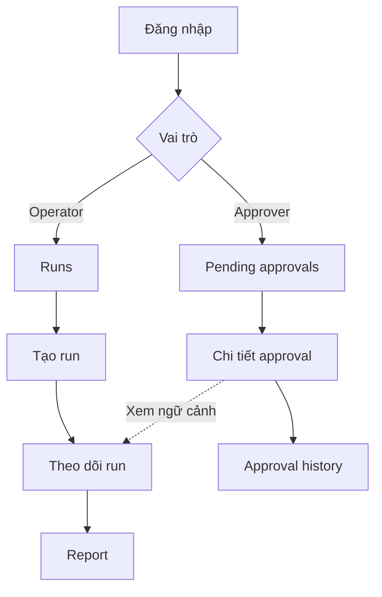
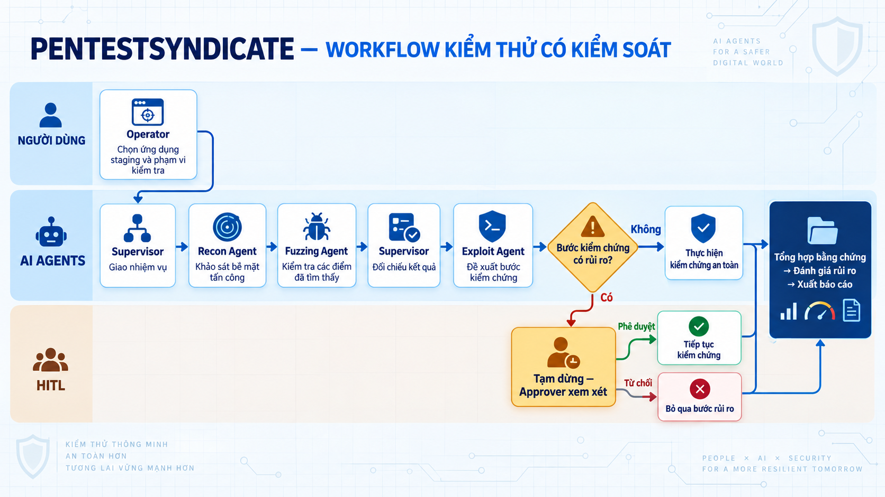
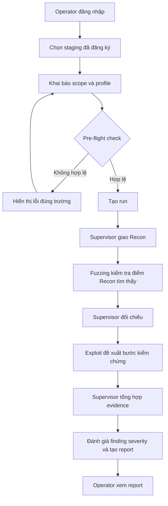
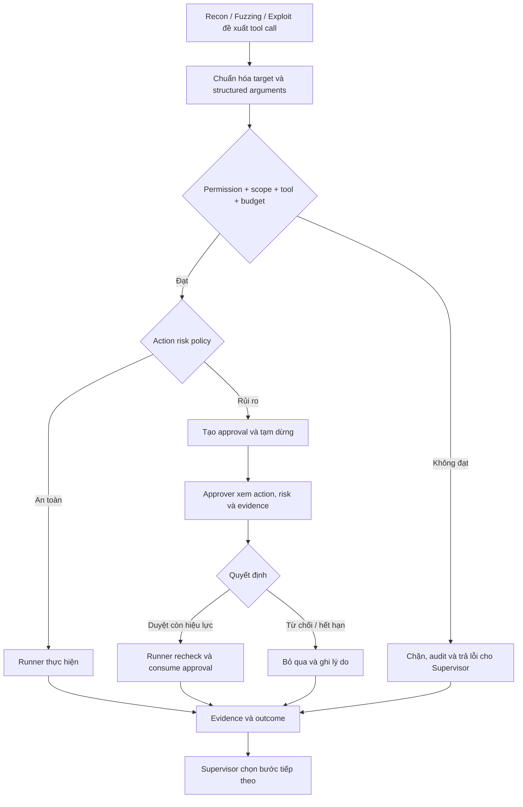
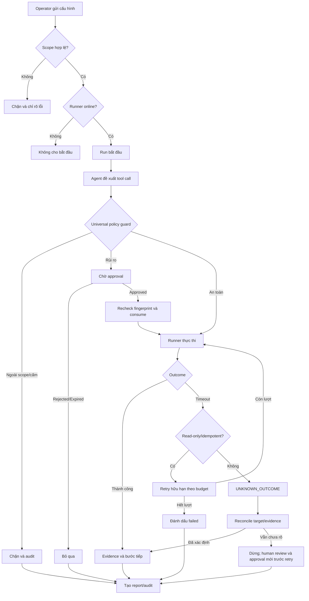
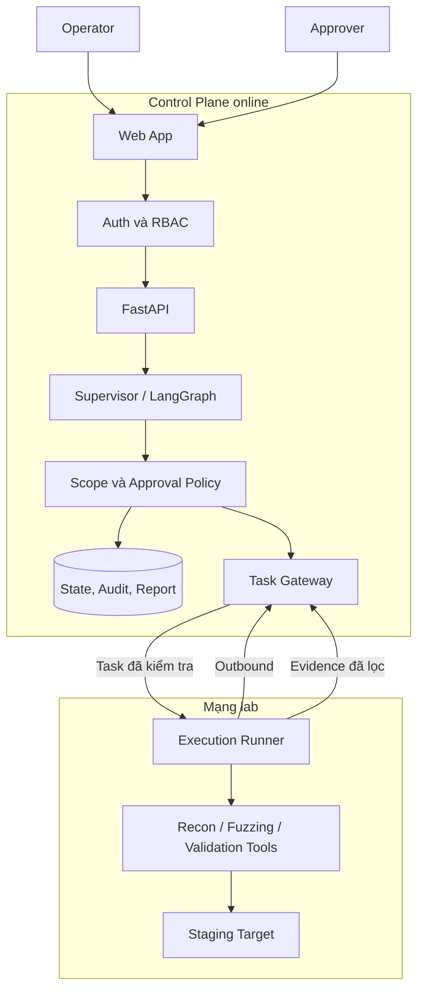

# Wireframe & UI Flow — PentestSyndicate
## Link UX/UI Web demo : "https://www.figma.com/make/8yU7hkANU9IwlYsYgyBjj6/Create-as-requested?t=XVAQ3Y5Wnfl5KzSI-20&fullscreen=1"
## 1. Phạm vi tài liệu

Đây là thiết kế TO-BE cho MVP. Repo hiện chưa có frontend, authentication, database, workflow pentest hoặc HITL. Các màn hình dưới đây là yêu cầu cần xây, không phải ảnh chụp sản phẩm đã hoàn thành.

MVP có năm màn hình nghiệp vụ chính và hai list view hỗ trợ điều hướng:

1. Đăng nhập.
2. Tạo đợt kiểm thử.
3. Theo dõi đợt kiểm thử.
4. Xử lý yêu cầu phê duyệt.
5. Xem và xuất báo cáo.

List view gồm danh sách Runs cho Operator và Approval Queue/History cho Approver.

## 2. Quyền theo vai trò

| Chức năng | Operator | Approver |
|---|:---:|:---:|
| Đăng nhập | Có | Có |
| Tạo run và chọn scope | Có | Không |
| Theo dõi run | Có | Chỉ đọc khi liên quan |
| Yêu cầu dừng run | Có | Không |
| Duyệt/từ chối action rủi ro | Không | Có |
| Xem report | Có | Có nếu được cấp quyền |
| Sửa action agent đề xuất | Không | Không |
| Dùng lại approval cũ | Không | Không |

Vai trò lấy từ tài khoản ở backend. Người dùng không tự chọn vai trò trên UI. Backend và runner phải kiểm tra quyền; việc ẩn nút không phải kiểm soát bảo mật.

## 3. Sơ đồ điều hướng



### 3.1 List view — Runs

```text
┌────────────────────────────────────────────────────────────────────┐
│ Runs                                              [+ Tạo run mới]  │
├────────────────────────────────────────────────────────────────────┤
│ Tìm kiếm [____________]  Trạng thái [Tất cả ▼]                    │
│ RUN-0042  Juice Shop  WAITING_APPROVAL  20:03      [Xem]          │
│ RUN-0041  Demo API    COMPLETED         18:20      [Xem report]   │
│ RUN-0040  Demo API    FAILED            17:11      [Xem lỗi]      │
└────────────────────────────────────────────────────────────────────┘
```

Empty state ghi “Chưa có đợt kiểm thử” và đưa tới Tạo run. Loading giữ header; lỗi tải có nút thử lại. Operator chỉ thấy run được cấp quyền.

### 3.2 List view — Approval Queue và History

```text
┌────────────────────────────────────────────────────────────────────┐
│ Pending approvals (2) | History                                   │
├────────────────────────────────────────────────────────────────────┤
│ AP-019  RUN-0042  HIGH    Expires 09:42            [Xem xét]      │
│ AP-018  RUN-0039  MEDIUM  Expires 24:10            [Xem xét]      │
├────────────────────────────────────────────────────────────────────┤
│ History: AP-017 APPROVED | AP-016 REJECTED | AP-015 EXPIRED       │
└────────────────────────────────────────────────────────────────────┘
```

Queue sắp theo thời gian hết hạn. Request đã được người khác xử lý chuyển ngay sang History; UI không cho gửi quyết định lần hai.

## 4. UI flow đầu cuối



Ảnh trên là bản trực quan của các giai đoạn. Hai ô Supervisor là cùng một agent xuất hiện trước Recon và tại bước đối chiếu. Mọi tool call của Recon, Fuzzing hoặc Exploit đều phải qua guard ở sơ đồ thứ hai; hình minh họa không thay thế quy tắc này.



### Guard áp dụng trước mọi tool call



## 5. Hệ thống trạng thái

### 5.1 Trạng thái run

| Enum chuẩn | Nhãn UI / ý nghĩa |
|---|---|
| `DRAFT` | Bản nháp |
| `VALIDATING_SCOPE` | Đang kiểm tra scope/kết nối |
| `QUEUED` | Đang chờ runner |
| `RECON_RUNNING` | Recon đang chạy |
| `FUZZING_RUNNING` | Fuzzing đang chạy |
| `CORRELATING` | Supervisor đang đối chiếu |
| `PROPOSING_VALIDATION` | Đang lập đề xuất kiểm chứng |
| `WAITING_APPROVAL` | Tạm dừng chờ Approver |
| `VALIDATION_RUNNING` | Đang kiểm chứng |
| `REPORTING` | Đang tạo report |
| `CANCEL_REQUESTED` | Đã yêu cầu dừng, chờ runner ACK |
| `UNKNOWN_OUTCOME` | Chưa xác định action đã tác động hay chưa |
| `COMPLETED` | Hoàn thành |
| `PARTIALLY_COMPLETED` | Có report nhưng một số bước lỗi/bị bỏ qua |
| `FAILED` | Không tạo được kết quả sử dụng được |
| `CANCELLED` | Đã dừng |

### 5.2 Trạng thái approval

- `PENDING`
- `APPROVED`
- `CONSUMED`: runner đã nhận quyền dùng một lần.
- `REJECTED`
- `EXPIRED`
- `SUPERSEDED`: action hoặc tham số thay đổi.
- `CANCELLED`: run đã dừng.

Nhánh approval hợp lệ là `PENDING → APPROVED → CONSUMED`. `REJECTED/EXPIRED/SUPERSEDED/CANCELLED` là terminal và không bao giờ chuyển sang `CONSUMED`. Approver chỉ tạo `APPROVED`; runner atomically claim `APPROVED → CONSUMED` ngay trước dispatch.

### 5.3 Trạng thái tool call

`PROPOSED → DISPATCHED → EXECUTING → SUCCEEDED/FAILED/UNKNOWN_OUTCOME`.

Approval status và tool-call status phải hiển thị riêng. `APPROVED` chỉ nói action được cấp quyền, không có nghĩa tool đã chạy hoặc thành công.

## 6. Wireframe màn hình 1 — Đăng nhập

**Mục tiêu:** Xác thực và chuyển tới màn hình theo vai trò.

```text
┌──────────────────────────────────────────────────────────┐
│                    PENTESTSYNDICATE                       │
│          Controlled AI Pentest Orchestration             │
├──────────────────────────────────────────────────────────┤
│                                                          │
│  Email                                                   │
│  [ operator@example.com                              ]    │
│                                                          │
│  Mật khẩu                                                │
│  [ ••••••••••••••••                                 ]    │
│                                                          │
│  [                 ĐĂNG NHẬP                         ]    │
│                                                          │
│  Không đăng nhập được? Liên hệ quản trị viên.            │
└──────────────────────────────────────────────────────────┘
```

**Quy tắc:**

- Email và mật khẩu bắt buộc; mật khẩu không hiển thị.
- Vai trò lấy từ backend.
- Operator đi tới Runs; Approver đi tới Pending approvals.

**Trạng thái cần có:** loading, sai thông tin, tài khoản khóa, không có quyền, session hết hạn, dịch vụ auth không phản hồi.

## 7. Wireframe màn hình 2 — Tạo đợt kiểm thử

**Mục tiêu:** Operator chỉ chọn một staging đã đăng ký và khai báo scope hữu hạn.

```text
┌────────────────────────────────────────────────────────────────────────┐
│ PentestSyndicate     Runs | New Run | Reports      ● Runner connected  │
├────────────────────────────────────────────────────────────────────────┤
│ TẠO ĐỢT KIỂM THỬ MỚI                                                   │
│                                                                        │
│ Ứng dụng staging *                                                     │
│ [ OWASP Juice Shop — Staging                         ▼ ]               │
│ Target: https://juice-shop.staging.internal                            │
│                                                                        │
│ Phạm vi được phép *                                                    │
│ Allowed paths:  [ /api/*, /rest/*                         ]            │
│ Excluded paths: [ /admin/delete, /payment                 ]            │
│                                                                        │
│ Scan profile:    [ Safe demo                              ▼ ]          │
│ Request rate:    [ 5 ] request/giây                                    │
│ Run expires at:  [ 20/09/2026 22:00                       ]            │
│                                                                        │
│ [✓] Tôi xác nhận mục tiêu và phạm vi đã được cấp phép.                 │
│                                                                        │
│ PRE-FLIGHT CHECK                                                       │
│ ✓ Target thuộc allowlist                                               │
│ ✓ Runner đang kết nối                                                  │
│ ✓ Scope hợp lệ                                                         │
│                                                                        │
│ [Lưu nháp]                                      [Bắt đầu kiểm thử]     │
└────────────────────────────────────────────────────────────────────────┘
```

Các giá trị trong wireframe chỉ là dữ liệu minh họa, không phải target đã được nhóm chốt.

| Trường | Bắt buộc | Quy tắc |
|---|:---:|---|
| Staging | Có | Chỉ chọn từ danh sách đăng ký |
| Target | Tự điền | Không sửa hostname tùy ý |
| Allowed paths | Có | Thuộc target đã chọn |
| Excluded paths | Không | Ưu tiên cao hơn allowed |
| Scan profile | Có | Chọn profile hữu hạn |
| Request rate | Có | Không vượt policy |
| Expiry | Có | Ở tương lai và trong giới hạn |
| Xác nhận cấp phép | Có | Phải chọn trước khi chạy |

**Trạng thái cần có:**

- Không có staging: hướng dẫn liên hệ người quản trị.
- Runner offline hoặc target không truy cập được: vô hiệu hóa nút bắt đầu.
- Scope sai: đánh dấu đúng trường và giữ dữ liệu đã nhập.
- Tạo run lỗi: không xóa form, cho phép thử lại.

## 8. Wireframe màn hình 3 — Theo dõi run

**Mục tiêu:** Hiển thị workflow, tool/evidence và lỗi theo thời gian.

```text
┌────────────────────────────────────────────────────────────────────────┐
│ PentestSyndicate     Runs | New Run | Reports      ● Runner connected  │
├────────────────────────────────────────────────────────────────────────┤
│ RUN-2026-0042                                [Dừng đợt kiểm thử]        │
│ Juice Shop — Staging | /api/* | Started 20:03                          │
│ Status: WAITING_APPROVAL                                               │
├────────────────────────────────────────────────────────────────────────┤
│ TIẾN TRÌNH                                                             │
│ ✓ Supervisor     Khởi tạo kế hoạch                     20:03           │
│ ✓ Recon          Tìm thấy 8 endpoint                   20:05           │
│ ✓ Fuzzing        2 điểm cần đối chiếu                  20:09           │
│ ✓ Supervisor     1 finding có evidence sơ bộ           20:10           │
│ ◷ Exploit        Đang chờ phê duyệt                    20:11           │
│ ○ Report         Chưa bắt đầu                                          │
├────────────────────────────────────┬───────────────────────────────────┤
│ SỰ KIỆN VÀ EVIDENCE                │ YÊU CẦU CẦN XỬ LÝ                 │
│ 20:05 Recon completed              │ Approval AP-019                   │
│ Evidence: EVD-031                  │ Risk: High                        │
│ 20:09 Fuzzing completed            │ Approver đang xem xét             │
│ Evidence: EVD-034, EVD-035         │ Operator không có quyền duyệt     │
│ 20:11 Execution paused             │                                   │
├────────────────────────────────────┴───────────────────────────────────┤
│ [Xem scope] [Xem sự kiện]                  [Report — chưa khả dụng]    │
└────────────────────────────────────────────────────────────────────────┘
```

**Thông tin bắt buộc:** Run ID, target/scope, người tạo, trạng thái, từng agent, timestamp, tool, evidence ID, lỗi/lý do bỏ qua và approval liên quan.

**Quy tắc:**

- Operator có thể yêu cầu dừng, nhưng không thể tự duyệt.
- Report chỉ bật khi có bản report.
- Khi chờ duyệt phải ghi rõ execution đã tạm dừng.

**Trạng thái cần có:** chờ runner, timeline loading, mất kết nối realtime, tool timeout, node failed, cancel requested, không tìm thấy/không có quyền.

## 9. Wireframe màn hình 4 — Phê duyệt action rủi ro

**Mục tiêu:** Approver có đủ ngữ cảnh; approval gắn với đúng action và tham số.

```text
┌────────────────────────────────────────────────────────────────────────┐
│ PentestSyndicate       Pending Approvals | History                     │
├────────────────────────────────────────────────────────────────────────┤
│ APPROVAL AP-019                                    Status: PENDING      │
│ Expires in: 09:42                                                      │
├────────────────────────────────────────────────────────────────────────┤
│ Run                 RUN-2026-0042                                      │
│ Application         Juice Shop — Staging                               │
│ Requested by        Exploit Agent                                      │
│ Target              POST /api/profile/image                            │
│ Proposed action     Upload harmless test payload                       │
│ Parameters          content-type=image/svg+xml; size=2 KB              │
│ Reason              Kiểm tra xử lý file upload                         │
│ Expected effect     Tạo một test file có thể xóa                       │
│ Risk                HIGH                                               │
│ Scope check         ✓ Trong scope                                      │
│ Evidence            EVD-034, EVD-035                                   │
│ Action fingerprint  ACT-93FA…                                          │
├────────────────────────────────────────────────────────────────────────┤
│ Ghi chú quyết định *                                                   │
│ [                                                                  ]   │
│ [✓] Tôi đã xem target, tham số và tác động dự kiến.                    │
│                                                                        │
│ [Từ chối]                                              [Phê duyệt]     │
└────────────────────────────────────────────────────────────────────────┘
```

Nội dung action trong wireframe là minh họa; tool/action thật phải được chốt với mentor và lab owner.

`Risk` trên màn approval là action risk dùng để quyết định HITL. Nó khác `severity` của finding trên report, vốn mô tả mức ảnh hưởng của lỗ hổng.

**Quy tắc nghiệp vụ:**

- Approval chỉ có hiệu lực cho action fingerprint hiện tại.
- Target/action/parameter đổi thì request cũ thành `Superseded`.
- Approval đã dùng không được dùng lại; hết hạn không thể duyệt.
- Lưu người quyết định, timestamp và ghi chú.
- UI chỉ gửi quyết định; runner kiểm tra lại trước tool call.
- Hiển thị `ApprovalRequest: APPROVED/CONSUMED` tách khỏi `ToolCall: DISPATCHED/EXECUTING/SUCCEEDED/FAILED/UNKNOWN_OUTCOME`.

**Trạng thái cần có:** không có request, loading, đã được người khác xử lý, hết hạn, xung đột quyết định, runner offline, lỗi lưu quyết định.

## 10. Wireframe màn hình 5 — Báo cáo

**Mục tiêu:** Đối chiếu finding với evidence, approval, failure và giới hạn.

```text
┌────────────────────────────────────────────────────────────────────────┐
│ PentestSyndicate     Runs | New Run | Reports                          │
├────────────────────────────────────────────────────────────────────────┤
│ REPORT — RUN-2026-0042                            [Tải JSON — đề xuất]│
│ Juice Shop — Staging | PARTIALLY_COMPLETED                             │
├────────────────────────────────────────────────────────────────────────┤
│ TÓM TẮT                                                               │
│ 1 VERIFIED | 1 SUSPECTED | 0 Critical | 1 Step skipped                 │
├────────────────────────────────────────────────────────────────────────┤
│ PHẠM VI                                                               │
│ Target: https://juice-shop.staging.internal                            │
│ Included: /api/*, /rest/*       Excluded: /admin/delete, /payment      │
├────────────────────────────────────────────────────────────────────────┤
│ PHÁT HIỆN                                                             │
│ ID       Mức độ    Trạng thái        Evidence                          │
│ F-001    High      VERIFIED          EVD-034, EVD-036      [Xem]       │
│ F-002    Medium    SUSPECTED         EVD-041               [Xem]       │
├────────────────────────────────────────────────────────────────────────┤
│ APPROVAL VÀ BƯỚC BỊ BỎ QUA                                            │
│ AP-019 Decision: APPROVED | ToolCall TC-044: SUCCEEDED                 │
│ AP-021 Expired — verification step skipped                            │
├────────────────────────────────────────────────────────────────────────┤
│ LỖI VÀ GIỚI HẠN                                                       │
│ - Một bước không thực hiện do approval hết hạn.                        │
│ - Kết quả chỉ áp dụng cho scope và thời điểm của run.                  │
│ - “Chưa kiểm chứng” không phải lỗ hổng đã xác nhận.                    │
└────────────────────────────────────────────────────────────────────────┘
```

**Nội dung bắt buộc:** Run/target/scope, summary, findings, finding severity, verification status `VERIFIED/SUSPECTED/NOT_VERIFIED`, evidence, approval history, skipped/failed steps, giới hạn và phiên bản workflow/model/tool. MVP đề xuất tải JSON; PDF là Could-have sau khi luồng chính ổn định.

**Trạng thái cần có:**

- Đang tạo report.
- Không có finding: dùng câu “Không có phát hiện trong phạm vi đã kiểm tra”.
- Report lỗi: giữ evidence đã lọc/sanitized và cho phép tạo lại. Raw artifact nếu thật sự cần chỉ nằm cô lập trong lab, mã hóa, giới hạn quyền/retention và control plane chỉ lưu hash/reference.
- Evidence thiếu: giữ finding nhưng đánh dấu thiếu evidence.
- Không có quyền: không lộ target hoặc cho tải file.

## 11. Luồng lỗi



## 12. Ghi chú Hybrid SaaS trên UI



- Header hiển thị runner: Connected, Degraded, Offline hoặc Last seen.
- Runner offline thì không bắt đầu run mới.
- Nếu mất kết nối giữa run, hiển thị thời điểm nhận trạng thái cuối.
- Mỗi task chứa run ID, scope snapshot, action fingerprint, expiry và approval ID nếu cần.
- Kênh outbound dùng runner credential ngắn hạn và authenticated mTLS, hoặc task dùng HMAC/digital signature; nonce được consume một lần. Plain hash không đủ xác thực.
- Runner chuẩn hóa host/IP/port/path/method, kiểm tra lại DNS/redirect và dùng egress deny-by-default.
- Tool chạy bằng binary cố định với structured arguments trong container không đặc quyền; agent không gửi shell command tùy ý.
- Nếu runner không xác minh được policy/approval hiện tại, hệ thống fail closed và không gọi tool.

## 13. Quy tắc hiển thị an toàn

- Không hiển thị password, token, cookie, API key hoặc payload nhạy cảm.
- Không cho lặp action bằng approval cũ.
- Không trình bày finding nghi vấn như đã xác minh.
- Không báo run thành công nếu bước quan trọng lỗi mà chưa xử lý.
- Mỗi lỗi nói rõ bước lỗi, ảnh hưởng và bước tiếp theo.
- Màu luôn đi kèm nhãn chữ; không dùng màu làm tín hiệu duy nhất.
- Nút dừng, từ chối và phê duyệt có nhãn rõ, chống gửi lặp.
