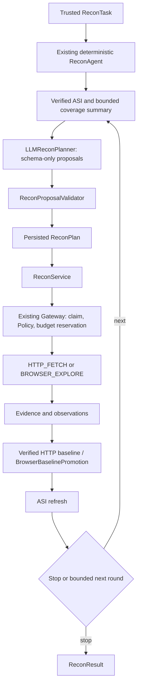

# Optional adaptive Recon planning

## Design review

The proposed separation fits the current engine: an LLM can suggest coverage work, while deterministic validation and the existing Policy/Gateway authorize execution. LangGraph orchestrates stages; SQLite retains the durable decisions and ToolRuns. AttackSurfaceInventory stays at v1.0.

Three implementation details make that separation concrete:

- `safe_http_probe` maps to bounded `HTTP_FETCH`, because the existing `HTTP_PROBE` only probes `/` and does not expose path/method scope enforcement.
- `content_discovery` is understood as a proposal kind but rejected as unsupported. FFUF has no approved capability/typed adapter in the current final-image manifest. Installing or advertising it requires a separate bounded adapter and real execution tests.
- Planning rounds are claimed and persisted before calling the model. Merely counting rounds in LangGraph memory would allow a restart to call the model again or reset action limits.

## Runtime



`AdaptiveReconAgent` wraps the existing engine; `create_recon_agent()` and `ReconAgent.run()` retain their deterministic behavior. No LLM is created, configured or invoked by default. The graph has stage nodes, not a node for every browser/network request. Its state only holds task ID, planning round and stop reason; context, decisions and plans are stored in SQLite.

Shared schemas are in `src/contracts/recon_planning.py`, with no dependency on the Recon implementation. Proposals accept only a kind, literal IP, port, HTTP(S) scheme, GET/HEAD method, local path, bounded rationale and priority (1 is highest). Extra fields such as commands, body, headers, query values or credentials are rejected. Stop wins over mixed action/stop batches.

The validator checks typed target/path constraints, capability availability and task authorization, known form/manual/required-input constraints, and semantic deduplication against planned or attempted requests. It preserves concrete template reconciliation. Equivalent canonical URLs cannot bypass dedup through percent encoding. The Gateway still checks policy and reserves budgets immediately before dispatch; a valid proposal is never an authorization token.

HTTP projection requires verified evidence, then uses the existing endpoint/observation/baseline contracts. Successful complete 2xx exchanges can qualify as FUZZ_READY; truncated or non-2xx responses cannot. Suggestions alone never become evidenced ASI entries. Browser proposals use the existing child interception boundary and fixed DOM extraction. Eligible browser observations pass through the existing separate HTTP baseline promotion.

## Limits and durable recovery

| Limit | Default | Hard maximum |
|---|---:|---:|
| LLM rounds per task | 2 | 3 |
| Proposals per round | 5 | 5 |
| Accepted LLM action roots per task | 8 | 8 |
| Model wait time | 20 seconds | 30 seconds |
| Context UTF-8 bytes | 32 KiB | 64 KiB |
| Model output bytes | 16 KiB | 16 KiB |
| Configured model output tokens | 2048 | 2048 |

An action root is one accepted HTTP fetch or browser exploration. Browser children and deterministic browser baseline requests additionally consume the existing shared task request/rate/body/time budgets. Browser proposal limits are fixed by code: at most 2 pages, depth 1, 8 child requests, 10 seconds, 64 KiB per response and 128 KiB admitted body total, further constrained by the task. The model cannot increase those limits.

Migration v7 adds only `recon_planning_sessions` and `recon_planning_rounds`. It does not alter task policy snapshots, historical fingerprints, ToolRuns, evidence or the v1.0 handoff schema. Sessions freeze the trusted task binding, planner identity and planning limits. Use a new task for a changed configuration.

Rounds progress through `PLANNING → DECIDED → VALIDATED → EXECUTED`. The atomic model claim has a 120-second lease. A concurrent worker does not make another call. A crashed/expired model claim is terminal with an unknown-outcome reason; no automatic retry is made. Provider refusal, malformed output, timeout or exception stops planning without dispatch. A late model response has no path to persistent decisions or target execution. The provider transport itself has a timeout and retries disabled; a local timeout does not guarantee remote provider cancellation.

Validated plans survive a crash before execution. ToolRun idempotency handles crash/restart during dispatch. Evidence projection and baseline promotion finish before marking the planning round executed. Rounds with only invalid/duplicate proposals stop. Limits, explicit model stop, expired/stale task, insufficient request budget or oversized scope context also stop planning. Durable details are available through `agent.store.rounds(task_id)` and `agent.store.status(task_id)`; they do not change the shared ReconResult/ASI schema.

## Context and model boundary

The deterministic context assembler exports scope, available public capabilities, verified route summaries, coverage counts/limitations, bounded service/technology names, previous action summaries and remaining budgets. It excludes raw evidence, HTML, response bodies, headers, cookies and query values. Lists are deterministically capped and trimmed; `context_truncated` signals omitted entries. Scope is never silently shortened to fit a prompt.

All target-derived strings are untrusted data, including route paths and technology names. The system prompt states that explicitly. Prompt wording does not authorize actions: schema validation, deterministic checks and Gateway policy enforce the boundary even if the model follows an injected instruction.

### Fake model first

```python
from src.recon.adaptive_agent import AdaptiveReconAgent
from src.recon.bootstrap import create_recon_agent
from src.recon.llm_planner import LLMReconPlanner

class StopModel:
    def invoke(self, messages):
        return {"proposals": [{
            "kind": "stop", "rationale": "No additional safe work", "priority": 1,
        }]}

repository, engine = create_recon_agent("data/recon.db", "data/evidence")
planner = LLMReconPlanner(StopModel(), planner_id="local-stop-v1")
agent = AdaptiveReconAgent(engine, planner)
# Persist a trusted ReconTask through repository.save_task(...) before running.
result = agent.run("existing-task-id")
```

### Explicit real-model connection

For an authorized literal-IP target, configure `OPENAI_API_KEY`, `OPENAI_BASE_URL` and `MODEL_NAME` locally in `.env`, then use the live runner. Replace the example URL with the actual scoped target:

```powershell
.\.venv\Scripts\python.exe -m scripts.run_recon_live --url "http://127.0.0.1:8000/" --task-id live-demo --browser --llm-rounds 2
```

The URL path is the default allowed prefix; `--path-prefix` can explicitly set a different enclosing prefix. The runner rejects hostnames, embedded credentials, unsupported scheme/port combinations and unsafe paths. It allows only HTTP_FETCH plus optional passive browser capabilities, with at most 40 total tool attempts, 64 KiB bodies and bounded planning/browser rounds. It does not enable Nmap/WhatWeb automatically.

Outputs are under `data/live-recon/live-demo/`: `recon.db`, `evidence/`, `evidence-index.json`, `result.json`, `inventory.json`, `planning.json` and `summary.json`. These contain real responses and should remain local. Reusing the task ID and arguments resumes persisted work; a different target/configuration requires a new task ID. Exit status 2 means the run did not finish with both verified evidence and a recorded model decision; inspect `summary.json` and planning status. API keys are never command arguments or exported records.

For Gemini, put `GOOGLE_API_KEY` (or `GEMINI_API_KEY`) in `.env`, optionally set `GEMINI_MODEL`, and add `--provider gemini`. `--model` can override the configured name. The Gemini route uses Google's official OpenAI-compatible endpoint; it does not send the Gemini key to OpenAI. The default Gemini model is `gemini-3.1-flash-lite`, verified in the live run described below.

```powershell
.\.venv\Scripts\python.exe -m scripts.run_recon_live --url "http://127.0.0.1:8080/" --task-id gemini-live-demo --provider gemini --browser
```

For application integration instead of the CLI:

```python
from src.config import get_settings
from src.contracts.recon_planning import ReconPlanningLimits
from src.recon.adaptive_agent import AdaptiveReconAgent
from src.recon.llm_planner import configured_planner

settings = get_settings()
limits = ReconPlanningLimits(max_llm_rounds=2, max_total_llm_actions=8)
planner = configured_planner(
    model_name=settings.model_name,
    api_key=settings.openai_api_key,
    base_url=settings.openai_base_url,
    timeout_seconds=limits.model_timeout_seconds,
)
agent = AdaptiveReconAgent(engine, planner, limits)
result = agent.run("new-trusted-task-id")
```

This explicitly sends the bounded scope/ASI summary to the configured model provider. Configure a model/endpoint supporting strict JSON-schema output. The client binds `ReconPlanningDecision` with `method="json_schema", strict=True`; it binds no execution tools. Unsupported provider behavior stops planning rather than falling back to arbitrary text. Credentials are passed only to the client and are never stored in the planning tables. A live provider call is not part of tests or startup.

## Verification

Adaptive-planning suite verification: **300 tests passed, zero skipped**, with `RECON_REQUIRE_CHROMIUM=1`; **Ruff PASS**. This includes all prior 258 tests and 42 additions. The Chromium suite is **13 passed**. Docker build and real five-adapter runtime/manifest smoke passed with migration v7. Changes remain local; no commit, push or new GitHub Actions run was made. Automated tests do not call a live model provider.

Separate live verification on 2026-09-29 used the user-supplied IP `222.252.26.124` and Gemini key from `.env`. Task `live-222-252-26-124-gemini-02` called `gemini-3.1-flash-lite`, persisted a valid stop proposal, and captured one verified HTTP exchange. The target returned HTTP 301 to `https://222.252.26.124/`; the runner did not follow it, so there is no complete page baseline or FUZZ_READY route. Evidence and planning records are in the ignored `data/live-recon/` directory. An earlier task/model attempt failed; its records were retained, not reset. Model listing alone did not prove generation availability: 2.5 Flash-Lite returned 404 and a separate 3.8 Flash probe returned 503 before the successful 3.1 Flash-Lite run.

- Fake-model tests exercise invalid schemas, hostile target/path suggestions, unsupported FFUF, missing capability, duplicate actions, forms/required inputs, template reconciliation, budget/round/action limits, context minimization, provider failure, concurrent claims, timeout/late-result fencing, crash repair and restart.
- The real LangChain/OpenAI structured client is tested through an `httpx.MockTransport`, checking JSON-schema mode and no execution tools. This does not claim live provider availability or model planning quality.
- Real Chromium E2E uses a fake planner to propose `/browser-only`, observes `/dynamic?source=browser`, creates the HTTP baseline and FUZZ_READY, and verifies zero extra network/model calls on reopening the repository. The forbidden sink receives zero requests.
- The existing deterministic, migration, runtime, browser and AST boundary tests remain in the full suite. No paid model calls, FFUF, RAG, Fuzzing, Validation, Approval or Finding logic are introduced.

Implementation references: [LangGraph stage graphs](https://reference.langchain.com/python/langgraph/graph/state/StateGraph), [LangChain ChatOpenAI structured output](https://docs.langchain.com/oss/python/integrations/chat/openai), and [OpenAI Structured Outputs](https://developers.openai.com/api/docs/guides/structured-outputs).
