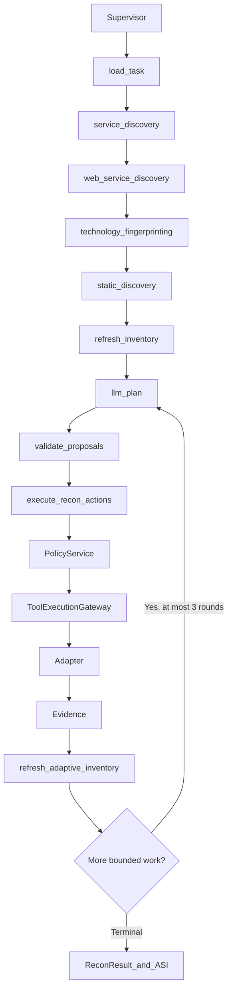

# Bounded adaptive Recon worker

Recon receives one immutable, authorized lab/staging mission (literal IP or a
[pinned web origin](recon-domain-support.md)). Supervisor
consumes the worker result; it does not sequence individual tools. Actors remain
Operator and Approver; future active verification is named Validation Agent.
LLM planning is optional intelligence. Policy/Gateway remain the authorities.
No vector RAG, Browser-Use, Fuzzing, Validation, Approval or Finding subsystem is added.

## Internal graph



The continuation is a conditional graph edge. Graph state contains only task ID,
round and stop reason. SQLite owns frozen stage plans, claims, contexts, decisions,
validated plans, ToolRuns and evidence.

`ReconAgent` exposes `run_service_discovery`, `run_web_service_discovery`,
`run_technology_fingerprinting`, `run_static_discovery(origins=...)`,
`run_browser_action` and `refresh_inventory`. Its deterministic `run()` retains
compatibility, including its optional automatic browser phase. Adaptive uses the
individual sensing stages; Browser starts only after a persisted validated proposal.

Nmap scans authorized ports in batches of at most 32. Successful open-service facts
select web candidates; closed ports get no HTTP probe, known non-web services get
no WhatWeb. Failed scans can use common authorized web-port fallbacks. Without
Nmap, bounded HTTP sensing can verify explicitly scoped ports. WhatWeb and static
discovery require verified HTTP origins. Existing parsers and ASI v1.0 remain intact.

## Explicit trusted mission

```powershell
python -m scripts.run_recon_live --target-ip 127.0.0.1 --ports 8000,8080 --provider gemini --browser --content-discovery --task-id lab-01
```

The IP/ports profile authorizes Nmap, HTTP probe, WhatWeb and HTTP fetch. Browser
and content discovery require flags. No port is added automatically. `--url`
retains the legacy HTTP-only profile. Credentials stay in `.env`; Gemini uses
`GOOGLE_API_KEY` or `GEMINI_API_KEY`. Automated tests do not call a live provider.

```python
from datetime import UTC, datetime, timedelta
from src.recon.models import Capability, ReconTask, Scope

task = ReconTask(id="lab-01", run_id="lab-01",
    scope=Scope(allowed_ips=("127.0.0.1",), allowed_ports=(8000, 8080),
        allowed_paths=("/",), allowed_methods=("GET", "HEAD"),
        capabilities=(Capability.NMAP_SCAN, Capability.HTTP_PROBE, Capability.WHATWEB,
            Capability.HTTP_FETCH, Capability.BROWSER_EXPLORE, Capability.BROWSER_REQUEST,
            Capability.CONTENT_DISCOVERY)),
    expires_at=datetime.now(UTC) + timedelta(minutes=30))
```

Scope grants permissions; adapter availability is checked separately. Chromium is
advertised only after a successful runtime probe. `browser_request` is internal.

## Planning contracts and checklist

| Proposal | Execution fields |
|---|---|
| `safe_http_probe` | literal IP, port, scheme, path, GET/HEAD method |
| `browser_explore` | literal IP, port, scheme, path |
| `content_discovery` | literal IP, port, scheme, prefix, trusted wordlist ID |
| `stop` | bounded reason code only |

Each has bounded rationale/priority. STOP cannot carry target/path/method/body or
be mixed with actions. BUDGET_EXHAUSTED is rejected while requests/actions remain.
Validation checks the current trusted task, versions, scope, scheme/port mapping,
runtime availability, budgets, manual/required inputs, wordlists and semantic
duplicates. Gateway rechecks before dispatch. Rationale never grants authority.

Context includes typed evidence-backed services/technologies, status codes,
baseline blockers, deterministic redirect classification, checklist gaps and
bounded prior actions. No raw body, HTML, headers, cookies, credentials or query
values are sent. `planning.current_round`, `max_rounds` and `future_rounds_remaining`
replace the ambiguous old remaining-round budget. A final round can still execute
actions. Complete generated task/context/FFUF/checklist examples are in
[recon-bounded-examples.json](recon-bounded-examples.json).

The ten-item curated registry is `src/recon/data/recon_checklist_v1.yaml`.
PENDING/COMPLETE/BLOCKED/UNSUPPORTED/NOT_APPLICABLE are computed from trusted scope,
runtime, results and verified evidence. The model cannot mark completion or gain
permissions from the checklist. The supplied PT_01 document has been reconciled
by STT against the ten safe groups. The [source mapping](recon-checklist-source-mapping.md)
records bounded subsets, derived steps, the Browser extension and excluded work.
Registry completion does not mean completion of an entire PT_01 pentest item.

## Bounded FFUF

```python
from src.recon.models import ContentDiscoveryParams
params = ContentDiscoveryParams(port=8000, scheme="http", path_prefix="/",
                                 wordlist_id="web-common-small-v1")
```

Trusted lists are `web-common-small-v1` (6 entries), `api-common-small-v1` (6), and
`well-known-small-v1` (3). Packaged bytes are checked against fixed entries, with
canonical SHA-256/version/category/phase metadata. IDs bind immutable v1 contents.

Docker pins Debian `ffuf=1.1.0-1+b8`. `CONTENT_DISCOVERY` is risk R1. Fixed argv uses
`shell=False`, literal IP, HEAD, one worker, 0.5-second delay, 2-second request
timeout, 15-second FFUF runtime and 20-second process timeout. No redirects,
recursion, calibration, inherited proxy or user FFUF config. No caller-controlled
method, header, Host, flags, file path, body, extension, template or command.

Gateway atomically reserves the whole wordlist count and serializes the batch with
other same-task dispatch. JSON is capped at 256 KiB and the wordlist result count;
off-scope/unrequested URLs are discarded. Evidence stores bounded candidates and
wordlist identity, not command/config dumps. HEAD retains no response body. Process
output is read from a temporary file with a cap; this is not an OS filesystem quota.

Candidates require a **separate** deterministic GET HTTP_FETCH through Gateway.
Only complete 2xx evidence satisfying the existing baseline predicate can become
FUZZ_READY. Redirect/403/500/truncated responses cannot qualify. Stable identities
reuse existing HTTP verification and never retry terminal FFUF/baseline work.

## Durability, limits and completion

Defaults/hard maxima: 2/3 LLM rounds, 5 proposals per round, 8 accepted root actions,
20/30-second model wait, 32/64-KiB context and 16-KiB model output. Browser proposals
retain fixed bounds: 2 pages, depth 1, 8 child requests, 10 seconds, 64 KiB per
response and 128 KiB admitted total, clamped to task limits. Every browser child
needs its existing external-dispatch permit; cancellation and late-result fences remain.

Migration v8 adds frozen `recon_stages`, sanitized model `error_code`, and
`request_units` on reservations (historical default 1). Historical fingerprints,
ToolRuns, evidence and ASI v1.0 are unchanged. Stop old workers before upgrading;
mixed worker versions on one database are unsupported.

Planning states remain PLANNING → DECIDED → VALIDATED → EXECUTED, or FAILED.
Model claim precedes the call; unknown outcomes never automatically retry.
Projection and baseline promotion finish before EXECUTED. Planner fingerprint
binds provider, model, implementation version, prompt and decision schema. Changed
or legacy planner sessions cannot silently resume; use a new mission.

Only sanitized MODEL_NOT_FOUND, PROVIDER_UNAVAILABLE, MODEL_TIMEOUT, AUTH_ERROR,
SCHEMA_INVALID, MODEL_REFUSAL or MODEL_ERROR is stored. Provider failure preserves
verified inventory and adds an adaptive limitation; it is not a model STOP reason.

Additive `ReconResult.worker_status` reports completion separately from coverage.
COMPLETED requires terminal bootstrap, no pending ToolRuns/sources, terminal
planning and validated ASI. `handoff_ready` means at least one FUZZ_READY entry.
Supervisor must require COMPLETED **and** handoff_ready before a future FuzzTask.
Zero ready entries is a valid completed result with an explicit limitation.

## Audit and gates

Every live run exports `run-manifest.json`, `summary.json`, `planning.json`,
`inventory.json`, `result.json`, `evidence-index.json`, `recon.db`, `evidence/`.
Manifest includes commit/source digest, Python/policy/schema versions, provider,
model, planner identity, scope, limits, runtime capabilities and timestamps.
Keys, Authorization, cookies and `.env` are not copied into the bundle. Captured
target evidence retains the existing local integrity/storage semantics.

See [verification](recon-bounded-verification.md) for exact gates and freeze verdict,
and [ADR 0004](adr/0004-bounded-adaptive-runtime.md) for compatibility decisions.
